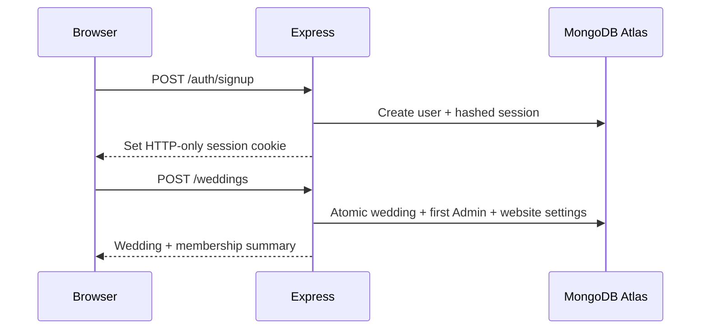
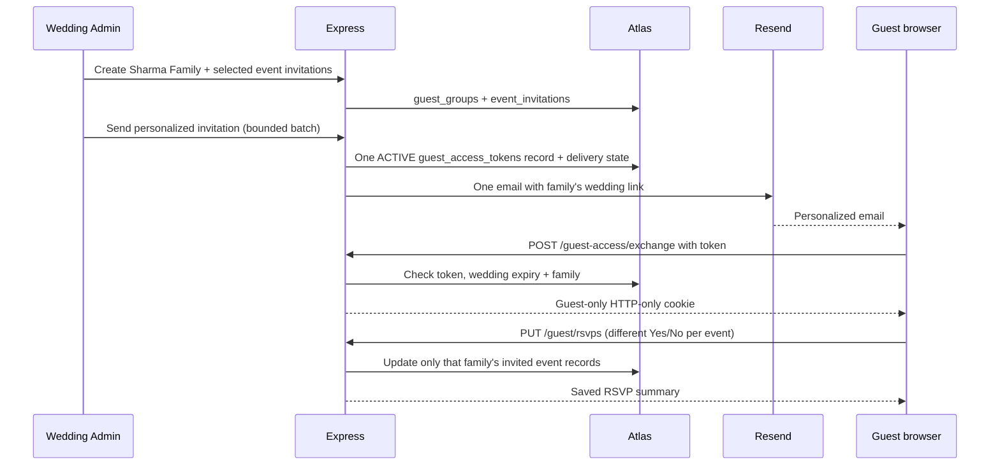
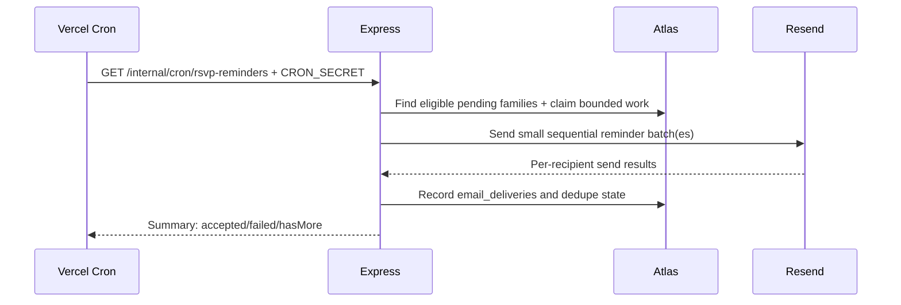

# Make My Marriage — REST API Design (V1)

**Version:** 1.0 Draft  
**Status:** Review draft — not an implementation or production sign-off  
**Date:** 28 September 2026  
**Companion documents:** `Make_My_Marriage_PRD_v1_Final.md`, `Make_My_Marriage_System_Architecture_HLD_v1.md`, `Make_My_Marriage_Database_Design_v1.md`  
**Stack:** Next.js + TypeScript frontend · Express + TypeScript backend · Zod · MongoDB Atlas / Mongoose · Cloudflare R2 · Resend · Google Places · Vercel

> **V1 contract:** Thirteen product modules, one Express modular monolith, and 18 agreed MongoDB collections. No email verification for signup or membership acceptance; no guest accounts; one invitation link per family and one RSVP per invited event; no budgets or spending caps; no photo approval workflow; no original uncompressed photos in storage; no message queue; an event stores a YouTube link rather than native video infrastructure.

---

## 1. Purpose and document boundaries

This document specifies the external and internal HTTP contract for Make My Marriage V1: routes, authorization, Zod validation, request and response structures, error semantics, pagination, idempotency, access rules, external-service boundaries, and end-to-end acceptance cases. It is an **API design**, not generated OpenAPI, source code, or the final UI design. Request examples use illustrative IDs; real IDs are 24-character MongoDB ObjectId strings. All routes below are prefixed by `/api/v1`, except the provider's direct R2 presigned URLs.

The backend consists of **one Express application** running as a Vercel Function. The Next.js frontend is a separate Vercel project in the same monorepo. Only Express accesses MongoDB, Resend credentials, R2 signing credentials, and Google Places server credentials.

### 1.1 Modules covered

| Product module | API ownership |
|---|---|
| 1. Authentication & Wedding Setup | `auth`, `weddings` |
| 2. Family & Organizer Management | `memberships` |
| 3. Multiple Wedding Events | `events` |
| 4. Wedding Dashboard | Read aggregation via public module interfaces; no owned collection |
| 5. Task Planner | `tasks` |
| 6. Expense Tracker & Payment Records | `expenses` |
| 7. Nearby Vendor Discovery & Management | `vendors` |
| 8. Guest Management & Event-wise Family RSVP | `guests`, `invitations` |
| 9. Digital Invitations & Email Notifications | `invitations`, `email` |
| 10. Collaborative Photo Gallery | `gallery` |
| 11. Personalized Wedding Website | `website` (including public read routes) |
| 12. YouTube Wedding Livestream Links | `events` (embedded field) |
| 13. Platform Admin Panel | `platform-admin` |

### 1.2 Intentionally absent

No email-verification API, guest signup/login, per-person guest list, RSVP headcount, budgeting/limit API, multi-provider streaming API, photo moderation/approval endpoint, Redis or message-queue endpoint, or standalone `livestreams` collection. Photos are **never** sent as multipart bodies through Express; only metadata and presigned-upload coordination cross the application API.

---

## 2. Global API conventions

| Concern | Contract |
|---|---|
| Production web | `https://makemymarriage.com` (illustrative; configure actual domain) |
| Production API | `https://api.makemymarriage.com/api/v1` (illustrative) |
| Transport | HTTPS in production |
| Format | JSON, camelCase, UTF-8; `Content-Type: application/json` for JSON writes |
| IDs | MongoDB ObjectId serialized as 24-character hex strings; always tenant-scoped |
| Dates/times | UTC ISO-8601 timestamps (e.g., `2026-12-14T13:30:00.000Z`) |
| Wedding date | Local civil date `YYYY-MM-DD`, coupled with an IANA timezone |
| Locations | Request `{latitude, longitude}`; persist GeoJSON `[longitude, latitude]` |
| Money | **Integer paise** only; `amountPaise`, `agreedAmountPaise`, currency `INR` |
| Version | `/api/v1`; additive non-breaking changes preferred; incompatible changes require `/api/v2` |
| Deletion | Soft-delete where specified; no automatic deletion of historical payments/audits |
| Cookies | Secure HTTP-only, revocable session cookie for registered users |
| Input validation | Zod parses body, params and query; Mongoose validates persistence separately |
| Error handling | Consistent JSON with stable `error.code` and safe user-facing message |
| API logging | Request ID and redacted metadata; never passwords, raw tokens or presigned URLs |

### 2.1 Success envelope

```json
{
  "success": true,
  "data": { "id": "66f000000000000000000001" },
  "meta": { "requestId": "req_7ab" }
}
```

For lists, `data` is an array and `meta` may also include `pagination`:

```json
{
  "success": true,
  "data": [{ "id": "66f000000000000000000001", "name": "Haldi" }],
  "meta": {
    "requestId": "req_7ab",
    "pagination": { "nextCursor": null, "hasMore": false, "limit": 20 }
  }
}
```

### 2.2 Error envelope

```json
{
  "success": false,
  "error": {
    "code": "VALIDATION_ERROR",
    "message": "Please review the highlighted fields.",
    "details": [
      { "path": "venue.latitude", "message": "Must be between -90 and 90" }
    ]
  },
  "meta": { "requestId": "req_7ab" }
}
```

Do not expose stack traces, MongoDB query details, provider keys, token values, or private data in error responses. For resources outside the user's wedding, prefer `404` rather than revealing that a private ID exists.

### 2.3 HTTP statuses

| Status | Usage |
|---|---|
| `200` | Successful read/update/action |
| `201` | New record created |
| `204` | Successful action with no response body (e.g., logout/delete) |
| `400` | Malformed JSON or syntactically invalid request |
| `401` | Missing/expired signed-in session or guest credential |
| `403` | Authenticated but insufficient wedding, album or platform permission |
| `404` | Missing or inaccessible resource; mask cross-wedding existence |
| `409` | Duplicate guest/event invite, existing membership, stale token, state conflict |
| `410` | Expired/revoked invitation link or expired guest access (when safe to disclose) |
| `413` | Payload exceeds configured maximum |
| `422` | Well-formed request fails Zod or a cross-field business rule |
| `429` | Throttled requests or provider quota reached, with `Retry-After` where known |
| `500` | Unexpected server error; sanitized |
| `502` / `503` | External integration failure / temporary application unavailability |

### 2.4 Pagination, sorting and filtering

Default `limit=20`, maximum `limit=100`. For growing lists (guest groups, photos, delivery history and audit logs), use an opaque cursor derived from stable `(createdAt, _id)` ordering. For small management screens, offset paging may be used when documented. Whitelist `sortBy` and `sortOrder` rather than accepting arbitrary database paths. Never accept a client-supplied `weddingId` in place of an authorized route/credential scope.

Example: `GET /weddings/:weddingId/guests?limit=20&cursor=<opaque>&search=sharma`.

**Express route order:** register literal routes such as `/expenses/summary`, `/expenses/export.csv`, `/guests/import/preview` and `/website/preview` before parameterized `/:expenseId` or `/:guestGroupId` handlers; otherwise the parameter route can intercept these names.

### 2.5 Idempotency and concurrency

- Require `Idempotency-Key: <UUID>` for **payment creation**. Duplicate retries return the original result; the unique partial `(weddingId, idempotencyKey)` index backs enforcement.
- Support `Idempotency-Key` for wedding creation, guest-token rotation and batch email dispatch when practical. Uniqueness for the latter is also enforced by `email_deliveries.dedupeKey`.
- Use compound unique indexes for membership and RSVP uniqueness. Use conditional updates/transactions for multi-document invariants (first Wedding Admin creation, invite acceptance, token rotation, and media quota reservations).
- If a client times out after a write, it should query the resource or retry **with the same idempotency key**, not silently issue a new payment or invitation campaign.

---

## 3. Authentication, authorization and credential boundaries

### 3.1 Registered-user sessions

- `POST /auth/signup` accepts email/password but **does not send or require an email-verification challenge**.
- Hash passwords with bcrypt. Store only `users.passwordHash` and a hashed, revocable opaque session token in `sessions`.
- Cookie name: `mmm_session` (illustrative), `HttpOnly; Secure; SameSite=Lax; Path=/` on production subdomains with correctly configured cookie domain. The API must be first-party/same-site to the web application where possible.
- For development across unrelated `*.vercel.app` domains, browser third-party cookie policies may block credentials. Prefer a same-origin local API proxy or owned preview subdomains rather than depending on third-party cookies. If truly cross-site cookies are necessary, `SameSite=None; Secure`, explicit credentialed CORS and additional CSRF protections are required.
- For mutating session/guest-cookie routes, enforce an exact Origin allowlist **and** an application CSRF token/header as appropriate. Do not treat CORS as CSRF protection.
- `GET /auth/me` resolves the authenticated user; roles within individual weddings come from `wedding_memberships` per request, not an indefinitely trusted client-side role flag.
- Password reset is permitted, but proving access to the reset email mailbox is required for that separate operation.

### 3.2 Role and permission vocabulary

`SUPER_ADMIN` is a **platform-level** role. `WEDDING_ADMIN` and `ORGANIZER` are stored in `wedding_memberships`. Wedding Admins have all wedding feature permissions; Organizers receive explicit flags such as `events`, `tasks`, `expenses`, `vendors`, `guests`, `invitations`, `gallery`, `website`, `livestream`, `members`. For a member, any action also checks membership `status=ACTIVE` and the requested resource's `weddingId`. Platform Super Admins do **not** routinely receive blanket access to private family expenses, RSVPs, photos or albums.

### 3.3 Guest access — no guest login

1. A family receives one high-entropy invitation link, e.g. `/invite/<random-token>`. Only the **hash** resides in `guest_access_tokens`.
2. The Next.js token landing page makes `POST /guest-access/exchange` with the raw token. The API validates the token, guest group, wedding status, wedding-configured expiry and optional earlier per-token expiry.
3. The API sets a **short-lived, signed, HTTP-only guest-access cookie** containing a minimal token-record reference and scope; it is not a user account or login. Subsequent guest API requests still recheck active token status and wedding expiry against MongoDB so revocation is immediate.
4. After a successful exchange, the frontend removes the raw token from the visible route (e.g. navigates to `/guest/wedding`). Do not load third-party trackers on the raw-token landing page. Use `Referrer-Policy: no-referrer` and `Cache-Control: no-store` on private guest pages.
5. A family sees **only events for which it has an `event_invitations` record**, and can submit separate Yes/No RSVPs. It may view any `INVITED_GUESTS` album belonging to its wedding, **including albums for functions it was not invited to**. Viewing does not automatically permit uploading.
6. A Wedding Admin chooses the guest-access expiry **after the final scheduled event**. Default: end of the local day 30 days after the last event. Admins may choose end-of-wedding-day access or a later post-wedding date (as long as it is not before the last event finishes). A guest's optional `expiresAtOverride` can only shorten that wedding-wide expiry. Public website pages may remain visible after private guest links expire.

The signed guest cookie is an API transport mechanism, **not an additional MongoDB collection**. Keep its lifetime short (e.g. 30 minutes; never beyond wedding expiry); the original link may be reopened while valid.

### 3.4 Separate shared QR album uploads

If a Wedding Admin enables a shared album-upload QR link, the bearer token is limited to **uploading to that particular album**, subject to expiry and upload caps; it never grants private-gallery viewing or wedding administration. Its hash and expiry live on the `albums` document, not in a new general-purpose guest table. Treat shared QR links as less attributable than unique family links. Default to individual family-link uploads when available.

### 3.5 Route notation used below

- **Public:** no session; returns only explicitly public content.
- **Member:** logged-in account with active membership for the route's wedding.
- **Feature:** Member with the specified permission, or Wedding Admin.
- **Admin:** Wedding Admin for that wedding.
- **Guest:** valid guest-access cookie belonging to that wedding/family.
- **Platform:** authenticated Platform Super Admin with strengthened administrative security.
- **Cron:** protected server-to-server request with `CRON_SECRET`, not a user cookie.

---

## 4. API endpoint catalog — authentication and weddings

All paths in this and subsequent tables are relative to `/api/v1`.

### 4.1 Authentication

| Method | Route | Auth | Contract / purpose |
|---|---|---|---|
| `POST` | `/auth/signup` | Public | Register and create session; no email verification |
| `POST` | `/auth/login` | Public | Email/password login, create revocable session |
| `POST` | `/auth/logout` | Member | Revoke current session and clear cookie |
| `GET` | `/auth/me` | Member | Return profile, session validity and accessible wedding summaries |
| `POST` | `/auth/password-resets/request` | Public | Send a short-lived reset link if account exists; identical generic response either way |
| `POST` | `/auth/password-resets/complete` | Reset token | Consume reset token, set bcrypt hash, revoke old sessions |
| `GET` | `/auth/sessions` | Member | List this account's active sessions (metadata only) |
| `DELETE` | `/auth/sessions/:sessionId` | Member | Revoke an owned session; current session may be revoked |

**Signup request**:

```json
{
  "displayName": "Ashish",
  "email": "ashish@example.com",
  "password": "UseAStrongPassword123!"
}
```

**Signup response (`201`)** — with `mmm_session` cookie (token is not in JSON):

```json
{
  "success": true,
  "data": {
    "user": { "id": "66f000000000000000000001", "displayName": "Ashish", "email": "ashish@example.com" },
    "weddings": []
  }
}
```

**Login:** normalize email for lookup; reject invalid credentials with a generic `401 INVALID_CREDENTIALS`; do not disclose whether an address exists. Rate-limit sensitive routes using a shared, serverless-compatible control, not per-process memory.

### 4.2 Wedding setup and dashboard

| Method | Route | Auth | Contract / purpose |
|---|---|---|---|
| `GET` | `/weddings` | Member | List caller's active wedding memberships; for wedding switcher |
| `POST` | `/weddings` | Member | Create wedding, first Admin membership and default website settings atomically |
| `GET` | `/weddings/:weddingId` | Member | Read authorized wedding details |
| `PATCH` | `/weddings/:weddingId` | Admin | Update names, wedding date, timezone, venue, title and cover reference |
| `DELETE` | `/weddings/:weddingId` | Admin | Start explicit soft-delete/archive workflow; confirm ownership policy first |
| `GET` | `/weddings/:weddingId/dashboard` | Member | Permission-aware aggregates: upcoming events, family RSVPs, assigned tasks, permitted expense totals |
| `GET` | `/weddings/:weddingId/storage-usage` | Feature: gallery | Used, reserved and quota bytes; never accept client-side counter updates |
| `PATCH` | `/weddings/:weddingId/guest-access-settings` | Admin | Choose post-event expiry; affects all active guest links dynamically |

**Create wedding request**:

```json
{
  "title": "Rahul & Priya Wedding",
  "brideName": "Priya",
  "groomName": "Rahul",
  "weddingDate": "2026-12-14",
  "timezone": "Asia/Kolkata",
  "slug": "rahul-priya",
  "defaultVenue": {
    "name": "The Celebration Hall",
    "address": "Jaipur, Rajasthan",
    "latitude": 26.9124,
    "longitude": 75.7873
  }
}
```

Server sets `createdBy`, all storage counters, `guestAccessExpiryMode=DEFAULT`, the default guest-access date, and the first membership. `slug` is unique (`409 SLUG_TAKEN`). Do **not** accept a budget field. If no event exists, use the wedding's local `weddingDate` to compute expiry; recompute the default when later events are added/changed.

**Guest-access settings request**:

```json
{
  "mode": "CUSTOM",
  "expiresAt": "2027-01-20T18:29:59.999Z"
}
```

Validate `expiresAt` falls **after** the final event's end-of-day in the wedding's IANA timezone. `mode=DEFAULT` tells the server to recalculate; ignore client-supplied default timestamps.

**Dashboard response** may include `pendingFamilyCount`, `confirmedFamilyCount`, `declinedFamilyCount` **per event**, but never inferred people/headcounts. Financial numbers are present only for users allowed to view expenses, and derive from non-voided `expense_payments` rather than budgets.

---

## 5. Wedding members and organizer invitations

| Method | Route | Auth | Contract / purpose |
|---|---|---|---|
| `GET` | `/weddings/:weddingId/members` | Member | List organizers and permission-aware summaries |
| `POST` | `/weddings/:weddingId/membership-invites` | Admin | Create single-use signed invite for Wedding Admin/Organizer; optionally send via Resend |
| `GET` | `/weddings/:weddingId/membership-invites` | Admin | Show pending/accepted/revoked invitations; never return raw tokens |
| `POST` | `/weddings/:weddingId/membership-invites/:inviteId/revoke` | Admin | Revoke pending invite |
| `GET` | `/membership-invites/:token/preview` | Public | Show minimal wedding, role and expiry; `Cache-Control: no-store` |
| `POST` | `/membership-invites/:token/accept` | Member | Accept possession-based invite; no email verification |
| `POST` | `/membership-invites/:token/decline` | Public or Member | Mark pending invite declined, requiring possession of valid token |
| `PATCH` | `/weddings/:weddingId/members/:membershipId` | Admin | Change role or feature permissions |
| `DELETE` | `/weddings/:weddingId/members/:membershipId` | Admin | Revoke membership, retaining history |

**Create invite**:

```json
{
  "email": "parent@example.com",
  "role": "ORGANIZER",
  "permissions": {
    "events": true,
    "tasks": true,
    "guests": true,
    "invitations": true,
    "expenses": false,
    "gallery": true
  }
}
```

Only known permission keys are allowed; unspecified Organizer flags default to `false`. A Wedding Admin role grants full wedding administration regardless of per-flag values. Membership acceptance requires login/signup but **not** email verification. The valid invite token is the possession proof. Consuming the invite and activating/upserting the unique `(weddingId,userId)` membership must be atomic; a reused invite returns `409 INVITE_ALREADY_USED`. Prevent concurrent removal of the last active Wedding Admin (`409 LAST_WEDDING_ADMIN`). Use expiry and one-use checks even when the invited address matches the user's unverified signup email; email-text equality alone cannot grant access.

---

## 6. Events and embedded YouTube livestreams

| Method | Route | Auth | Contract / purpose |
|---|---|---|---|
| `GET` | `/weddings/:weddingId/events` | Member | Search/filter/sort authorized event list |
| `POST` | `/weddings/:weddingId/events` | Feature: events | Create event and its single default event album |
| `GET` | `/weddings/:weddingId/events/:eventId` | Member | Read event details |
| `PATCH` | `/weddings/:weddingId/events/:eventId` | Feature: events | Edit schedule, description, venue, cover or status |
| `DELETE` | `/weddings/:weddingId/events/:eventId` | Feature: events | Soft-delete or cancel; preserve photos and expense history |
| `PUT` | `/weddings/:weddingId/events/:eventId/livestream` | Feature: livestream | Configure optional YouTube URL and enabled flag on the **event document** |
| `DELETE` | `/weddings/:weddingId/events/:eventId/livestream` | Feature: livestream | Disable/remove URL, preserving event |

**Create event**:

```json
{
  "name": "Haldi",
  "type": "HALDI",
  "description": "Morning function",
  "startAt": "2026-12-12T05:30:00.000Z",
  "endAt": "2026-12-12T08:30:00.000Z",
  "timezone": "Asia/Kolkata",
  "venue": {
    "name": "Family Home",
    "address": "Jaipur, Rajasthan",
    "latitude": 26.9124,
    "longitude": 75.7873,
    "mapUrl": "https://maps.google.com/?q=26.9124,75.7873"
  }
}
```

Validate `endAt > startAt` and venue ranges; convert to `[longitude, latitude]` only at persistence. `201` returns the new event and `defaultAlbumId`. If the album creation fails in a multi-document transaction, roll back/retry. A cancelled event remains in historical vendor/expense records but is not offered as an active guest RSVP event. Schedule changes may require reconfirmation/notification and recalculation of **DEFAULT**, not CUSTOM, guest access expiry.

**Minimal livestream update**:

```json
{ "enabled": true, "youtubeUrl": "https://www.youtube.com/live/EXAMPLE_ID" }
```

Allow only supported HTTPS YouTube hosts and recognized watch/live URL forms (including `youtu.be`), normalize to a safe canonical link, and reject arbitrary iframe HTML or unsupported domains. Guests receive the URL only when the wedding website/event visibility permits it. No custom video hosting, chat, tracking or playback API.

---

## 7. Tasks

| Method | Route | Auth | Contract / purpose |
|---|---|---|---|
| `GET` | `/weddings/:weddingId/tasks` | Feature: tasks | Filter by `eventId`, `status`, `assigneeUserId`, date and priority |
| `POST` | `/weddings/:weddingId/tasks` | Feature: tasks | Create wedding-level or event-specific task |
| `GET` | `/weddings/:weddingId/tasks/:taskId` | Feature: tasks | Read task with bounded checklist/comments |
| `PATCH` | `/weddings/:weddingId/tasks/:taskId` | Feature: tasks | Change fields/status/assignees/checklist within limits |
| `POST` | `/weddings/:weddingId/tasks/:taskId/comments` | Feature: tasks | Append comment to embedded bounded list |
| `DELETE` | `/weddings/:weddingId/tasks/:taskId` | Feature: tasks | Soft-delete task |

**Create task**:

```json
{
  "eventId": null,
  "title": "Confirm catering menu",
  "description": "Finalize vegetarian options",
  "priority": "HIGH",
  "dueAt": "2026-12-01T12:00:00.000Z",
  "assigneeUserIds": ["66f000000000000000000001"],
  "checklist": [{ "text": "Confirm menu", "completed": false }]
}
```

Assignees must be active members of the same wedding. Enforce V1 checklist/comment length and count limits. The server sets `createdBy`, `completedAt` and audit metadata; status values are `TODO`, `IN_PROGRESS`, `COMPLETED`, `CANCELLED`. The task's `eventId` may be omitted for wedding-wide tasks.

---

## 8. Expenses and actual payments — no budgets

| Method | Route | Auth | Contract / purpose |
|---|---|---|---|
| `GET` | `/weddings/:weddingId/expenses` | Feature: expenses | List expenses; filter by event/scope/category/vendor and date |
| `POST` | `/weddings/:weddingId/expenses` | Feature: expenses | Create one event or wedding-wide expense |
| `GET` | `/weddings/:weddingId/expenses/:expenseId` | Feature: expenses | Read agreed cost and derived paid/outstanding amounts |
| `PATCH` | `/weddings/:weddingId/expenses/:expenseId` | Feature: expenses | Edit amount/category/associations; never rewrite historical payments |
| `DELETE` | `/weddings/:weddingId/expenses/:expenseId` | Feature: expenses | Archive/soft-delete with auditable handling of existing payments |
| `GET` | `/weddings/:weddingId/expenses/:expenseId/payments` | Feature: expenses | List non-voided and authorized voided payment history |
| `POST` | `/weddings/:weddingId/expenses/:expenseId/payments` | Feature: expenses | Record manual payment; requires `Idempotency-Key` |
| `POST` | `/weddings/:weddingId/expenses/:expenseId/payments/:paymentId/void` | Admin / finance-authorized | Void a mistaken payment with reason and audit record |
| `GET` | `/weddings/:weddingId/expenses/summary` | Feature: expenses | Total paid, unpaid agreed amounts, category/event/wedding-wide breakdown |
| `GET` | `/weddings/:weddingId/expenses/export.csv` | Feature: expenses | Stream/export only permitted wedding financial data |

**Create event-specific expense**:

```json
{
  "scope": "EVENT",
  "eventId": "66f000000000000000000011",
  "relatedEventIds": [],
  "title": "Haldi decorations",
  "category": "DECORATION",
  "agreedAmountPaise": 5000000,
  "currency": "INR"
}
```

**Create shared wedding-wide expense** — one invoice for a photographer covering three functions:

```json
{
  "scope": "WEDDING_WIDE",
  "relatedEventIds": [
    "66f000000000000000000011",
    "66f000000000000000000012",
    "66f000000000000000000013"
  ],
  "vendorSelectionId": "66f000000000000000000099",
  "title": "Photography package",
  "category": "PHOTOGRAPHY",
  "agreedAmountPaise": 15000000,
  "currency": "INR"
}
```

`EVENT` requires one `eventId` and **no** `relatedEventIds`; `WEDDING_WIDE` forbids `eventId`, and related events are informational only. Never divide or multiply shared payments across related events. Financial dashboards show wedding-wide spending separately. `agreedAmountPaise` may be absent for expenses recorded after-the-fact; the actual amount paid is always derived from payments.

**Create partial payment**:

```http
POST /api/v1/weddings/66f000000000000000000010/expenses/66f000000000000000000014/payments
Idempotency-Key: 703404aa-7b22-4a9a-9ca5-67e0933cf8f1
Content-Type: application/json
```

```json
{
  "amountPaise": 3000000,
  "currency": "INR",
  "paidAt": "2026-12-01T10:30:00.000Z",
  "paymentMethod": "UPI",
  "reference": "UPI-REF-123",
  "note": "Photography advance"
}
```

**Response (`201`)**:

```json
{
  "success": true,
  "data": {
    "paymentId": "66f000000000000000000015",
    "expenseId": "66f000000000000000000014",
    "amountPaise": 3000000,
    "totalPaidPaise": 3000000,
    "outstandingPaise": 12000000,
    "currency": "INR"
  }
}
```

When agreed cost is missing, `outstandingPaise` is `null`, not zero. An explicit payment void leaves the record visible to authorized staff but removes it from actual-spending totals. A double-click/retry with the same idempotency key must not record money twice. An expense with existing payments should normally be archived/void-managed rather than silently dropped from historical accounting.

---

## 9. Vendor discovery and saved vendors

| Method | Route | Auth | Contract / purpose |
|---|---|---|---|
| `GET` | `/vendors/nearby?latitude=&longitude=&category=&radiusMeters=` | Member / Feature: vendors | Server-side Google Places search around selected coordinates |
| `GET` | `/vendors/place/:placeId` | Member / Feature: vendors | Current third-party place details where allowed |
| `GET` | `/weddings/:weddingId/vendors` | Feature: vendors | Saved shortlist/bookings/manual vendors |
| `POST` | `/weddings/:weddingId/vendors` | Feature: vendors | Save a Google Place ID or manually added vendor |
| `GET` | `/weddings/:weddingId/vendors/:vendorId` | Feature: vendors | Wedding-owned vendor record; optionally enrich third-party display live |
| `PATCH` | `/weddings/:weddingId/vendors/:vendorId` | Feature: vendors | Contacted / Negotiating / Booked / Rejected, own notes, quote, assigned events |
| `DELETE` | `/weddings/:weddingId/vendors/:vendorId` | Feature: vendors | Soft-delete shortlist entry; preserve linked financial history |

Example: `GET /api/v1/vendors/nearby?latitude=26.9124&longitude=75.7873&category=PHOTOGRAPHER&radiusMeters=10000`. Return only fields currently authorized by the Places API plan and display terms, with attribution. A provider record is not a booking.

**Save vendor**:

```json
{
  "source": "GOOGLE_PLACES",
  "googlePlaceId": "example-google-place-id",
  "serviceCategory": "PHOTOGRAPHY",
  "status": "SHORTLISTED",
  "relatedEventIds": [],
  "notes": "Contact for a three-event quotation"
}
```

For `source=MANUAL`, accept `customName`, optional `manualContact`, `manualAddress`, and user-entered coordinates if needed. Do not permanently copy Google-supplied ratings, photographs or business details into our database without permission. Save the provider identifier and **our own** notes, agreed quotes and booking state. Rate-limit expensive Places calls and never expose the server-side Google key to clients.

---
## 10. Guest groups and independent event RSVPs

### 10.1 Wedding Admin / organizer endpoints

| Method | Route | Auth | Contract / purpose |
|---|---|---|---|
| `GET` | `/weddings/:weddingId/guests` | Feature: guests | Cursor-paginated family directory with search/category |
| `POST` | `/weddings/:weddingId/guests` | Feature: guests | Create **one family**, no member array or headcount |
| `GET` | `/weddings/:weddingId/guests/:guestGroupId` | Feature: guests | Family details and event-wise RSVP summary |
| `PATCH` | `/weddings/:weddingId/guests/:guestGroupId` | Feature: guests | Edit display name, email, phone, category and notes |
| `DELETE` | `/weddings/:weddingId/guests/:guestGroupId` | Feature: guests | Soft-delete family and revoke its active guest link |
| `POST` | `/weddings/:weddingId/guests/import/preview` | Feature: guests | Validate frontend-parsed CSV rows; report duplicates/errors, no writes |
| `POST` | `/weddings/:weddingId/guests/import` | Feature: guests | Bounded batch of validated parsed rows, with per-row outcomes |
| `GET` | `/weddings/:weddingId/event-invitations` | Feature: guests | Event-wise RSVP table filtered by event/status/family |
| `POST` | `/weddings/:weddingId/event-invitations` | Feature: guests | Idempotently upsert selected family-to-event invitations |
| `DELETE` | `/weddings/:weddingId/event-invitations/:invitationId` | Feature: guests | Remove a family's invitation to an event; record prior state in audit |
| `PUT` | `/weddings/:weddingId/guests/:guestGroupId/rsvps` | Feature: guests | Record manual phone/WhatsApp responses, with audit attribution |
| `GET` | `/weddings/:weddingId/events/:eventId/rsvp-summary` | Feature: guests | Family counts: invited, `YES`, `NO`, `PENDING` |
| `POST` | `/weddings/:weddingId/guests/:guestGroupId/access-link/rotate` | Feature: invitations | Revoke old link and generate a new one; raw URL shown **once** to authorized organizer |
| `POST` | `/weddings/:weddingId/guests/:guestGroupId/access-link/revoke` | Feature: invitations | Revoke family link without deleting RSVPs |

**Create guest group**:

```json
{
  "displayName": "Sharma Family",
  "email": "sharma@example.com",
  "phone": "+919800000000",
  "category": "BRIDE_FAMILY",
  "notes": "Send directions before the wedding"
}
```

Do not accept `members`, `memberCount`, `adults`, `children`, `plusOnes`, or per-person attendance fields. A family email is optional and **not unique**; two family records may share a contact email. CSV import must not silently merge probable duplicates. No guest user account is created.

**Upsert event invitations**:

```json
{
  "guestGroupId": "66f000000000000000000021",
  "eventIds": [
    "66f000000000000000000011",
    "66f000000000000000000012",
    "66f000000000000000000013"
  ]
}
```

Each selected pair receives one `event_invitations` record; repeat upsert is idempotent and **must not overwrite an existing `YES` or `NO`**. Enforce the unique `(weddingId,eventId,guestGroupId)` index. Removal of an event invitation is a deliberate administrative action; do not conflate it with a `NO` RSVP. Preserve a relevant audit snapshot if a responded invitation is removed.

### 10.2 Guest-facing endpoints — zero login requirement

| Method | Route | Auth | Contract / purpose |
|---|---|---|---|
| `POST` | `/guest-access/exchange` | Raw valid invitation token | Establish short-lived guest cookie, with server-side status/expiry validation |
| `POST` | `/guest-access/logout` | Guest | Clear guest cookie; original invitation link remains valid unless revoked |
| `GET` | `/guest/wedding` | Guest | Display wedding details and **only this family's invited events** |
| `GET` | `/guest/rsvps` | Guest | Return the family's `PENDING/YES/NO` state by invited event |
| `PUT` | `/guest/rsvps` | Guest | Update one or more invited-event responses, with deadline checks |
| `GET` | `/guest/albums` | Guest | List permitted wedding albums under their visibility settings |
| `GET` | `/guest/albums/:albumId/media` | Guest | Signed private image reads or public URLs where allowed |

**Token exchange**:

```json
{ "token": "long-cryptographically-random-token-from-invitation-link" }
```

**Successful exchange**: the API sets an HTTP-only `mmm_guest` cookie and returns **only** the family display name, permitted wedding summary and access expiry (never another family's data or the raw token). Invalid/revoked/expired links return `410 GUEST_LINK_EXPIRED` or an equally non-disclosing failure. The frontend clears the raw token from its visible URL before loading external content.

**Guest RSVP update**:

```json
{
  "responses": [
    { "eventId": "66f000000000000000000011", "rsvpStatus": "YES" },
    { "eventId": "66f000000000000000000012", "rsvpStatus": "NO" },
    { "eventId": "66f000000000000000000013", "rsvpStatus": "YES" }
  ]
}
```

**Response (`200`)**:

```json
{
  "success": true,
  "data": {
    "familyName": "Sharma Family",
    "responses": [
      { "eventId": "66f000000000000000000011", "rsvpStatus": "YES" },
      { "eventId": "66f000000000000000000012", "rsvpStatus": "NO" },
      { "eventId": "66f000000000000000000013", "rsvpStatus": "YES" }
    ]
  }
}
```

Guest requests must be scoped to the **exact family's** existing event invitations. A guessed event ID is not permission to add the family to an event; return `404`/`403` with no event detail leak. No individual guest count is accepted or returned. Batch response updates should be transactional or validated completely before any write, so one invalid event does not cause a misleading partial success. Event RSVP deadlines are enforced server-side; an authorized organizer can record a late/manual response. Sending an RSVP confirmation email is best-effort after the database commit: a mail failure must **not roll back a successful RSVP**.

---

## 11. Email invitations, delivery history and daily reminders

There is **no queue or background worker** in V1. Express sends bounded synchronous Resend batches on user-initiated requests; daily RSVP reminders run via Vercel Cron against the API project. MongoDB `email_deliveries` stores send attempts and deduplication state, but is not a general-purpose queue.

| Method | Route | Auth | Contract / purpose |
|---|---|---|---|
| `POST` | `/weddings/:weddingId/invitations/send-batch` | Feature: invitations | Send at most 20 personalized family invitations per call |
| `GET` | `/weddings/:weddingId/invitations/eligible` | Feature: invitations | Paginate eligible guests with email, pending status, prior send status |
| `GET` | `/weddings/:weddingId/email-deliveries` | Feature: invitations | Cursor-paginated send attempt history |
| `POST` | `/weddings/:weddingId/email-deliveries/:deliveryId/retry` | Feature: invitations | Retry only a definitively failed attempt when safe |
| `GET` | `/internal/cron/rsvp-reminders` | Cron | Daily protected, bounded reminder processing |

**User-initiated batch request**:

```json
{
  "guestGroupIds": [
    "66f000000000000000000021",
    "66f000000000000000000022"
  ],
  "sendGroupId": "c1c1f708-a378-4584-bf85-e97fdbe1c1dc",
  "explicitResend": false
}
```

- **Maximum 20 families** per call (configurable downward). Validate email presence, active guest status and eligible event invitations. Keep one personalized invitation email for all events to which the family is invited.
- Each recipient gets a distinct `email_deliveries` record and `dedupeKey` derived from wedding/family/type/`sendGroupId`. A retry with the **same** send-group ID must not double-send successfully accepted messages. Return `200` with per-recipient `SENT`, `FAILED`, `UNKNOWN` or `SKIPPED` outcomes. Here `SENT` means **accepted by Resend**, not delivered to inbox.
- The frontend may request the next batch after the prior batch completes and show progress. This avoids long-running requests and keeps us within Vercel Function limits. Batching reduces HTTP requests but **does not bypass Resend's daily or monthly email allowance**.
- `UNKNOWN` is used when Resend may have accepted the message but the API timed out; reconcile with provider message IDs/logs instead of blindly retrying. For `FAILED`, a bounded retry may be offered.
- `explicitResend=true` is an organizer action with UI warning if it would rotate an existing guest-access token; don't silently invalidate previously shared links. See **Section 17.1** for the one small unresolved database/API compatibility point about reproducing existing hashed-only tokens for future reminders/resends.

**Batch response**:

```json
{
  "success": true,
  "data": {
    "sendGroupId": "c1c1f708-a378-4584-bf85-e97fdbe1c1dc",
    "acceptedCount": 1,
    "failedCount": 1,
    "results": [
      { "guestGroupId": "66f000000000000000000021", "status": "SENT", "deliveryId": "66f000000000000000000071" },
      { "guestGroupId": "66f000000000000000000022", "status": "FAILED", "errorCode": "PROVIDER_REJECTED" }
    ]
  }
}
```

### 11.1 Daily Vercel Cron

**`GET /api/v1/internal/cron/rsvp-reminders`** — Vercel Cron uses **GET** to call the production endpoint. Verify `Authorization: Bearer <CRON_SECRET>` in constant time. A cron User-Agent alone is not authentication. The endpoint must be inaccessible to guest/wedding sessions and must not return private family details to its caller.

The daily run:

1. Find non-cancelled upcoming events with pending RSVPs and unexpired guest access; group pending events **by family** so each family receives at most one reminder per reminder window.
2. Exclude opted-out/absent email, passed RSVP deadlines, very recent reminders and suspended weddings.
3. Claim eligible reminder `email_deliveries` rows atomically with a dedupe key (e.g., wedding/family/reminder-window). Process a bounded number (initially 20 per run, adjustable against provider quota and actual Function duration).
4. Send via Resend; store provider ID, timestamp and status; if capacity remains, process another bounded batch only while comfortably within the execution budget.
5. Return an operational summary: `processed`, `accepted`, `failed`, `skipped` and `hasMore`. Unprocessed recipients can be considered during the **next day's** run. No in-memory timers or fire-and-forget promises.

**Cron sample response**:

```json
{
  "success": true,
  "data": {
    "processed": 20,
    "accepted": 19,
    "failed": 1,
    "skipped": 3,
    "hasMore": true
  }
}
```

If the free-tier Resend allowance is reached, stop and mark remaining recipients eligible for a later run rather than bypassing limits. Invitation campaigns and reminders share the same provider limit; admins should see a quota-aware status. Exact minute delivery is not promised. The reminder should include the family's valid invitation link **once Section 17.1's link-reuse policy is settled**.

---

## 12. Albums, direct R2 uploads and media delivery

### 12.1 Authorized album management

| Method | Route | Auth | Contract / purpose |
|---|---|---|---|
| `GET` | `/weddings/:weddingId/albums` | Member / Feature: gallery | List event and custom albums with visibility/access filtering |
| `POST` | `/weddings/:weddingId/albums` | Feature: gallery | Create custom album (`EVENT` albums created by the Event service) |
| `GET` | `/weddings/:weddingId/albums/:albumId` | Feature: gallery | Get album configuration |
| `PATCH` | `/weddings/:weddingId/albums/:albumId` | Feature: gallery | Title, cover, visibility, guest-upload setting, shared-QR configuration |
| `DELETE` | `/weddings/:weddingId/albums/:albumId` | Feature: gallery | Soft-delete album; schedule controlled object cleanup |
| `GET` | `/weddings/:weddingId/albums/:albumId/media` | Feature: gallery | Cursor-paginated READY images |
| `POST` | `/weddings/:weddingId/albums/:albumId/uploads/init` | Feature: gallery | Reserve capacity and return signed PUT URLs |
| `POST` | `/weddings/:weddingId/albums/:albumId/uploads/:mediaId/complete` | Feature: gallery | Verify R2 objects and finalize immediately |
| `DELETE` | `/weddings/:weddingId/media/:mediaId` | Feature: gallery | Delete/tombstone image; adjust quota and revoke delivery |
| `POST` | `/weddings/:weddingId/albums/:albumId/shared-upload-link/rotate` | Admin | Enable/revoke and regenerate scoped QR upload token; show raw link once |

### 12.2 Guest and public photo endpoints

| Method | Route | Auth | Contract / purpose |
|---|---|---|---|
| `GET` | `/guest/albums` | Guest | All permitted albums; `INVITED_GUESTS` is wedding-wide |
| `GET` | `/guest/albums/:albumId/media` | Guest | READY assets with private short-lived URLs when required |
| `POST` | `/guest/albums/:albumId/uploads/init` | Guest + permitted album | Upload compressed image + thumbnail if `guestUploadEnabled` |
| `POST` | `/guest/albums/:albumId/uploads/:mediaId/complete` | Guest + same uploader | Verify/finalize guest upload, no approval |
| `GET` | `/public/weddings/:slug/albums` | Public | PUBLIC albums only when the website's public gallery section is published |
| `GET` | `/public/weddings/:slug/albums/:albumId/media` | Public | PUBLIC READY images, no private media URLs |
| `POST` | `/public/albums/:albumId/shared-uploads/init` | Shared QR token in body | Scoped upload only; no implicit private read rights |
| `POST` | `/public/albums/:albumId/shared-uploads/:mediaId/complete` | Same QR token in body | Verify/finalize same scoped upload |

**Album visibility**:

- `PUBLIC`: readable publicly **only if** the associated website/gallery section is published for public viewing; public R2/CDN delivery is permitted.
- `INVITED_GUESTS`: readable by **any actively invited family of the wedding**, regardless of the particular event's invitation list. Website permission still applies; short-lived R2 GET access only.
- `ORGANIZERS_ONLY`: Wedding Admins and explicitly gallery-authorized Organizers; not accessible with guest or QR credentials.
- Upload permission is distinct from read permission. Shared QR codes authorize only the configured upload operation; anyone with the QR token may submit within its constraints, so rate limits and expiry are essential.

### 12.3 Two-step direct R2 upload

The browser compresses the main image **before** upload and creates a thumbnail. It provides metadata but the backend treats it as untrusted. For each image, reserve storage for **both objects** atomically on `weddings.storageReservedBytes` before signing URLs. Initial upload state is `media_assets.status=RESERVED`.

**Upload-init request**:

```json
{
  "main": {
    "mimeType": "image/webp",
    "sizeBytes": 1800000,
    "width": 3200,
    "height": 2400
  },
  "thumbnail": {
    "mimeType": "image/webp",
    "sizeBytes": 85000,
    "width": 480,
    "height": 360
  }
}
```

**Response (`201`)**:

```json
{
  "success": true,
  "data": {
    "mediaId": "66f000000000000000000030",
    "expiresAt": "2026-12-12T06:10:00.000Z",
    "uploads": {
      "main": {
        "method": "PUT",
        "url": "https://<r2-api-domain>/<signed-object-url>",
        "headers": { "Content-Type": "image/webp" }
      },
      "thumbnail": {
        "method": "PUT",
        "url": "https://<r2-api-domain>/<signed-thumbnail-url>",
        "headers": { "Content-Type": "image/webp" }
      }
    }
  }
}
```

The two sample URLs above are **illustrative placeholders**, not real credentials. Never log these URLs or store them in MongoDB. The browser then issues the **two PUT requests directly to R2**, not through Express. Browser CORS on R2 must allow the frontend origin and the signed headers.

**Upload-complete request**:

```json
{ "mediaId": "66f000000000000000000030" }
```

On completion, Express verifies both expected object keys and actual byte sizes in R2; validate file signatures/content as far as the V1 verification strategy allows instead of trusting the declared MIME type alone. Atomically move reserved bytes to used bytes and set `status=READY`. The album's visibility rules apply **immediately** after READY, with **no approval or moderation step**. A retry of `complete` for an already READY upload returns the same result and must not charge storage twice. A failed or abandoned reservation must eventually expire and release quota; orphaned objects require cleanup.

### 12.4 Reading and deleting media

Listing media returns object metadata and an appropriate URL, never permanent credentials. Return public CDN URLs **only** for expressly public, published assets. For private/invited albums, generate short-lived R2 presigned GET URLs after authorizing each request, with `Cache-Control: private, no-store` on the listing. Deleting an image tombstones it, removes R2 main/thumbnail objects, updates quota and invalidates private delivery; where assets were public, purge cached CDN copies as practical. Existing third-party downloads and unexpired bearer URLs cannot be instantly recalled. Provide a Wedding Admin delete action even though guest uploads are not pre-approved.

---

## 13. Personalized website and public read APIs

| Method | Route | Auth | Contract / purpose |
|---|---|---|---|
| `GET` | `/weddings/:weddingId/website` | Feature: website | Read draft website/theme/privacy settings |
| `PATCH` | `/weddings/:weddingId/website` | Feature: website | Update template, colors, story, hero, section toggles and privacy |
| `POST` | `/weddings/:weddingId/website/publish` | Feature: website | Publish if slug, content and access rules are valid |
| `POST` | `/weddings/:weddingId/website/unpublish` | Feature: website | Hide public website without deleting planning records |
| `GET` | `/weddings/:weddingId/website/preview` | Feature: website | Preview draft with authorized event data |
| `GET` | `/public/weddings/:slug` | Public | Return **only** safe public published wedding data |
| `GET` | `/public/weddings/:slug/events` | Public | Only publicly permitted, published events |
| `GET` | `/guest/wedding` | Guest | Invitation-only wedding summary and this family's permitted events |

**Website update**:

```json
{
  "templateId": "classic-01",
  "theme": { "primaryColor": "#A64F69", "secondaryColor": "#FFF4EB" },
  "welcomeMessage": "Celebrate with us!",
  "coupleStory": "Our story...",
  "privacy": "PUBLIC",
  "sections": {
    "story": true,
    "events": true,
    "rsvp": true,
    "gallery": true,
    "livestream": true,
    "venue": true
  }
}
```

Do not duplicate event dates, RSVPs or live links in `website_settings`; resolve these from the canonical `events` and `event_invitations` data. Public reads must **never** reveal invitation tokens, internal organizer notes, expenses, other families' RSVPs/contact details or private photos. A public site's RSVP button directs an invited family through its **unique invitation link**; merely knowing the public website slug does not grant a guest identity. If `privacy=INVITATION_ONLY`, an unauthenticated public read should return a minimal safe landing state, not private event content.

---

## 14. Platform Super Admin and service operations

| Method | Route | Auth | Contract / purpose |
|---|---|---|---|
| `GET` | `/platform-admin/overview` | Platform | Aggregate users, weddings, upload/storage and mail error statistics |
| `GET` | `/platform-admin/users` | Platform | Paginate accounts and operational status, not their private wedding content |
| `PATCH` | `/platform-admin/users/:userId/status` | Platform | Suspend/reactivate; log reason and actor |
| `GET` | `/platform-admin/weddings` | Platform | Paginate wedding metadata and platform status |
| `PATCH` | `/platform-admin/weddings/:weddingId/status` | Platform | Suspend/reactivate/archive after permitted checks; audit |
| `GET` | `/platform-admin/integrations` | Platform | Sanitized Resend/R2/Places/cron health summaries |
| `GET` | `/platform-admin/storage` | Platform | Storage usage/quota statistics; no private media downloads |
| `GET` | `/platform-admin/audit-logs` | Platform | Paginated operational audit logs with redacted metadata |
| `POST` | `/platform-admin/media/:mediaId/remove` | Platform + explicit reason | Exceptional removal of publicly reported/inappropriate media, audited |
| `GET` | `/health` | Public | Minimal API-liveness check; no secret configuration details |

The Platform Super Admin operates a **separate authorization boundary** from Wedding Admins. Platform dashboard views expose aggregate/operational metadata only. Exceptional actions affecting private records need narrowly scoped internal services and audit trails; this is **not** a universal private-data read API. Before handling real customers' data, enforce MFA or equivalent strengthened protection on Platform Super Admin accounts. A dedicated content-report submission workflow would require an additional agreed persistence design; V1 can accept support reports outside the application and log resulting admin actions in `audit_logs` without adding a nineteenth collection.

---

## 15. Zod validation and business-invariant examples

Zod owns **boundary validation**. Mongoose owns schema-level persistence checks. Services own cross-document invariants. Do not use `req.body` directly in Mongoose create/update; parse to an allowlisted DTO and set tenant/actor fields server-side. Illustrative TypeScript snippets:

```ts
import { z } from 'zod';

export const objectId = z.string().regex(/^[a-f\d]{24}$/i, 'Invalid ID');
export const paise = z.number().int().safe().nonnegative();
export const paidPaise = paise.refine(n => n > 0, 'Payment must be positive');
export const coordinates = z.object({
  latitude: z.number().min(-90).max(90),
  longitude: z.number().min(-180).max(180),
});

export const createGuestGroup = z.object({
  displayName: z.string().trim().min(1).max(120),
  email: z.email().optional(),
  phone: z.string().max(30).optional(),
  category: z.enum([
    'BRIDE_FAMILY', 'GROOM_FAMILY', 'FRIEND', 'COLLEAGUE', 'OTHER'
  ]).optional(),
  notes: z.string().max(1000).optional(),
}).strict(); // Disallow individual-member or headcount fields.

export const guestRSVP = z.object({
  responses: z.array(z.object({
    eventId: objectId,
    rsvpStatus: z.enum(['YES', 'NO']),
  }).strict()).min(1).max(20),
}).strict().refine(
  v => new Set(v.responses.map(r => r.eventId)).size === v.responses.length,
  { message: 'Duplicate event in one response' }
);

export const createExpense = z.discriminatedUnion('scope', [
  z.object({
    scope: z.literal('EVENT'), eventId: objectId,
    relatedEventIds: z.array(objectId).length(0),
    vendorSelectionId: objectId.optional(),
    title: z.string().trim().min(1).max(160),
    category: z.string().trim().min(1).max(60),
    agreedAmountPaise: paise.optional(),
    currency: z.literal('INR'),
  }).strict(),
  z.object({
    scope: z.literal('WEDDING_WIDE'),
    relatedEventIds: z.array(objectId).max(30),
    vendorSelectionId: objectId.optional(),
    title: z.string().trim().min(1).max(160),
    category: z.string().trim().min(1).max(60),
    agreedAmountPaise: paise.optional(),
    currency: z.literal('INR'),
  }).strict(),
]);

export const recordPayment = z.object({
  amountPaise: paidPaise,
  currency: z.literal('INR'),
  paidAt: z.iso.datetime({ offset: true }),
  paymentMethod: z.enum(['CASH', 'UPI', 'BANK_TRANSFER', 'CARD', 'OTHER']),
  reference: z.string().max(100).optional(),
  note: z.string().max(1000).optional(),
}).strict();
```

**Implementation note:** The snippets use current-style Zod APIs as design pseudocode; pin the actual Zod major version in the monorepo and compile/test these schemas before copying them verbatim. Always validate ObjectId **and** ownership. Validate `timezone` against supported IANA timezones, `weddingDate` as a real civil date, URL host allowlists, color syntax, pagination bounds, and storage limits. Preserve meaningful provider errors for support logs while returning safe client messages.

**Concurrency-dependent invariants:** last Wedding Admin preservation; one active family token; unique family/event invitation; guest-access expiry after the final event; idempotent payment creation; R2 quota reserve/commit/release; and once-only membership acceptance. Use conditional writes and transactions/retries where necessary. The backend must not assume that a client-side disabled button enforces any of these rules.

---

## 16. Core sequence diagrams and consistency behavior

### 16.1 Registered-user wedding creation



No email-verification step exists. A failed wedding transaction leaves no orphaned wedding without an admin.

### 16.2 Family invited to multiple events, single link



The family is not asked for individual members, headcounts or passwords. A failed email does not invalidate a successfully saved RSVP.

### 16.3 Direct photo upload with immediate publication

```mermaid
sequenceDiagram
  participant G as Guest browser
  participant API as Express
  participant DB as MongoDB Atlas
  participant R2 as Cloudflare R2
  G->>G: Compress main image + generate thumbnail
  G->>API: POST /guest/albums/:id/uploads/init
  API->>DB: Authorize album and atomically reserve bytes
  API->>DB: Create media_assets (RESERVED)
  API-->>G: Two short-lived presigned PUT URLs
  G->>R2: PUT compressed photo + thumbnail
  G->>API: Complete upload
  API->>R2: Verify both objects and sizes
  API->>DB: Move reserved -> used bytes; set READY
  API-->>G: Image visible under album privacy; NO approval
```

### 16.4 Daily reminder (no message queue)



---

## 17. Cross-document reconciliation and implementation decisions

The following items are not new product features; they are points where a **precise API contract** needs a small implementation decision or clarification.

### 17.1 Reusing a family's link in later email reminders

**Issue:** The finalized database stores only `guest_access_tokens.tokenHash` (good for security). A one-way hash **cannot be reversed** to recover the invitation URL for a reminder or a resend. Rotating the token every time an email is sent would invalidate earlier invitations and frustrate guests.

**Recommended minimal database amendment:** add an optional **authenticated-encrypted token value** to the existing `guest_access_tokens` document (e.g., AES-256-GCM ciphertext, nonce/IV, authentication tag and encryption key version), protected by an application key stored outside MongoDB in Vercel server secrets. Keep `tokenHash` for lookup; decrypt only immediately before authorized invitation/reminder delivery and redact raw tokens from logs. This adds fields to **one of our 18 existing collections**, not a new collection or queue. Support key rotation operationally. If the team declines this amendment, reminders should not claim to include the original personalized link; an admin-triggered resend must rotate the old link with an explicit warning. **Review this one small change before implementing invitation resends and scheduled reminders.**

### 17.2 What does an expired family link mean for albums?

A family's invitation link inherits the wedding's configured date (default: **30 days after the final event**; Wedding Admin can choose another date after the event). After expiry, it can no longer issue fresh private gallery URLs. Public website/gallery material may remain public if published. Already downloaded photos or still-valid signed URLs cannot be retroactively recalled. The admin can extend access within the product's configured retention rules.

### 17.3 Shared QR token versus invited-family identity

A general venue QR upload link is shareable, so possession is sufficient for its narrow upload capability but **is not evidence that the holder is an invited family**. The QR path must not expose invitation-only galleries or RSVPs. Default to family-link uploads where possible. Wedding Admins can remove an accidentally shared photo **after** upload; there is no pre-publication approval feature.

### 17.4 Email sending limits and no queue

A bounded synchronous request is safe only up to the configured 20-recipient batch. The frontend drives a larger campaign as sequential requests; a daily cron performs separately bounded reminder work. Persist per-recipient status **before** and **after** each Resend call. If the campaign or cron stops midway, resume or retry only rows whose statuses are known to be safe. Resend acceptance does not imply inbox delivery. Set operational limits against the actual provider plan and Vercel Function execution limits.

### 17.5 Public media on the CDN

The Cloudflare CDN can cache only **explicitly public, published** photos/website assets. `INVITED_GUESTS` and `ORGANIZERS_ONLY` photos remain on private R2 reads using short-lived signed GET URLs. A change from public to private also requires revoking/purging public delivery where feasible. A public custom domain is **not** itself an authorization layer.

### 17.6 Atomic operations on Atlas

The selected Atlas deployment must support the required transaction patterns for wedding creation, invite acceptance and quota accounting. Review/retry transactions under contention, especially concurrent last-admin removals and simultaneous guest photo uploads. Use idempotency and cleanup of abandoned reservations rather than assuming each HTTP request runs once.

---

## 18. API security, performance and deployment checklist

- [ ] Two Vercel projects built from one monorepo; server-only API credentials never embedded in the Next.js client bundle.
- [ ] Controlled origin/cookie topology; CSRF defenses for cookie-authenticated writes; exact CORS allowlist with credentials where needed.
- [ ] Passwords bcrypt-hashed; login/logout revocable; password-reset token short-lived and single-use; signup and membership acceptance require **no email verification**.
- [ ] Authenticated access never trusts a client-provided role; re-evaluate active wedding membership and permission flags for each protected operation.
- [ ] Guest cookie is short-lived; active DB token and wedding expiry checked on private requests; token removed from browser URL after exchange.
- [ ] ObjectIds validated syntactically **and** scoped by wedding ID and ownership.
- [ ] Body/query/header input parsed with Zod; disallow unknown privilege, budget/headcount or photo-approval fields.
- [ ] Money uses safe integer paise; duplicate payments blocked with idempotency; shared vendor expenses counted only once.
- [ ] R2 PUT is direct browser-to-storage; verify stored objects before READY; public CDN only for deliberately public assets; no raw original retention.
- [ ] Guest-uploaded READY photographs visible immediately under album privacy; no pending-review queue; authorized admins retain delete powers.
- [ ] Email attempts bounded and persisted, with safe retry and explicit UNKNOWN state; no message broker or in-memory scheduler.
- [ ] Vercel Cron calls protected **GET** endpoint; daily reminder work bounded and grouped by family.
- [ ] Google Places search validates coordinates and category; billing guardrails and attribution preserved.
- [ ] YouTube URL is a validated event field, never user-provided iframe HTML.
- [ ] PII minimized in public responses, logs and audit events; platform-admin access is least privilege.
- [ ] Prepare production backup/restore strategy, rate-limit/abuse controls and platform-admin MFA before onboarding real weddings.

---

## 19. Representative API acceptance tests

| Test | Given / action | Expected result |
|---|---|---|
| API-01 | New user signs up | `201`, session cookie, **no verification requirement** |
| API-02 | User creates wedding | First active Admin membership and website settings exist |
| API-03 | Parent opens valid membership invite and signs up | Can accept without email verification; invite consumed once |
| API-04 | Organizer without `expenses` permission calls expense endpoint | `403`, no financial data |
| API-05 | Admin attempts to revoke the last active Wedding Admin | `409 LAST_WEDDING_ADMIN` |
| API-06 | Duplicate family/event invitation upsert | One record, prior YES/NO preserved |
| API-07 | Guest link attempts RSVP for an uninvited event | Denied without exposing event details |
| API-08 | Family RSVPs YES to Haldi, NO to Sangeet | Two independent event invitation states; **no headcount** |
| API-09 | Guest link has expired after configured post-wedding date | No private RSVP/album access; public pages remain governed separately |
| API-10 | Wedding family not invited to Haldi requests `INVITED_GUESTS` Haldi album | Allowed while wedding guest access is valid |
| API-11 | Photographer covers three events for a single agreed price | One wedding-wide expense; no duplicated event spending |
| API-12 | Client retries same payment with same idempotency key | No duplicate payment; identical result |
| API-13 | Guest uploads valid compressed photo and thumbnail | Two R2 objects, `READY` metadata, immediate visibility; **no approval** |
| API-14 | Browser skips R2 upload and calls complete | Verification fails; no READY record or consumed storage |
| API-15 | Two guests upload simultaneously near storage quota | Atomic reservations prevent over-quota uploads |
| API-16 | Invitation campaign has 63 families | Four sequential calls of at most 20; individual delivery outcomes persisted |
| API-17 | Resend timeout produces uncertain result | `UNKNOWN`, not blindly retried |
| API-18 | Daily cron invoked without valid secret | `401`/`403`, no reminders sent |
| API-19 | Public visitor requests a private wedding/gallery | Only safe public shell or access-denied response; no private media |
| API-20 | Wedding Admin provides non-YouTube URL | `422`; URL never embedded |
| API-21 | Organizer changes public album to private | New private reads require authorization; CDN invalidation initiated |
| API-22 | Platform Admin browses operational users/weddings | Sees operational metadata, not general private wedding content |

---

## 20. Suggested code organization and incremental implementation

```text
apps/api/src/
  app.ts                         # Express export for Vercel
  server.ts                      # Local HTTP startup and database connection
  config/                        # Env validation and Atlas connection
  common/
    errors/                      # Centralized API errors
    middleware/                  # Auth, wedding access, Zod and request middleware
  modules/
    auth/
    weddings/
    memberships/
    events/
    tasks/
    expenses/
    vendors/
    guests/
    invitations/
    gallery/
    website/
    email/
    audit/
    platform-admin/
  integrations/
    r2/
    resend/
    google-places/
  jobs/
    rsvp-reminders/               # Protected daily cron entry point
packages/contracts/
  src/
    index.ts                     # Genuinely shared client-safe types and Zod schemas
```

**Suggested build order:** (1) global envelope/Zod/error handling and Atlas connection; (2) signup/login/sessions and wedding creation; (3) memberships/permissions; (4) events/tasks; (5) guest groups and per-event RSVP; (6) expense/payments; (7) Resend batches and cron; (8) vendor discovery; (9) R2 gallery; (10) website and YouTube link; (11) platform operations and end-to-end security tests. Build high-risk guest-token, idempotency and storage-quota tests early; do not leave them entirely for the end.

---

## 21. Official implementation references

These are **implementation references**, not additional V1 product features. Check the live provider documentation again at the time of deployment.

- [Vercel — Express on Vercel](https://vercel.com/docs/frameworks/backend/express)
- [Vercel — Cron Jobs: GET trigger behavior](https://vercel.com/docs/cron-jobs)
- [Vercel — Securing Cron Jobs](https://vercel.com/docs/cron-jobs/manage-cron-jobs)
- [Cloudflare R2 — Presigned URLs](https://developers.cloudflare.com/r2/api/s3/presigned-urls/)
- [Cloudflare R2 — Browser CORS](https://developers.cloudflare.com/r2/buckets/cors/)
- [Resend — Batch Emails API](https://resend.com/blog/introducing-the-batch-emails-api)
- [MongoDB — Unique Indexes](https://www.mongodb.com/docs/manual/core/index-unique/)
- [MongoDB — Transactions](https://www.mongodb.com/docs/manual/core/transactions/)

---

## 22. API design review and sign-off

- [ ] Endpoint naming, versioning, auth and response envelopes approved.
- [ ] User signup and member-invite acceptance work with **no email verification**.
- [ ] One family link + independently persisted event Yes/No RSVPs approved.
- [ ] Guest link expiry matches the finalized wedding-level default/custom policy.
- [ ] Gallery access is wedding-wide for `INVITED_GUESTS`; guest uploads publish after technical verification without approval.
- [ ] Expense and payment endpoints use integer paise and do **not** expose budget/limit features.
- [ ] One wedding-wide expense may reference several events without splitting costs.
- [ ] R2 direct-upload/complete and CDN/privacy boundaries approved.
- [ ] Email batching and daily cron can run within actual Vercel/Resend plan limits; no queue.
- [ ] **Resolve Section 17.1**: securely reproduce the existing invitation link for future reminder/resend emails without silently rotating guest links.
- [ ] Agree on API error codes and acceptance tests before implementation.

**Document status:** Draft for your review. It deliberately flags one minor invitation-token persistence decision rather than silently altering the already-finalized database design.
