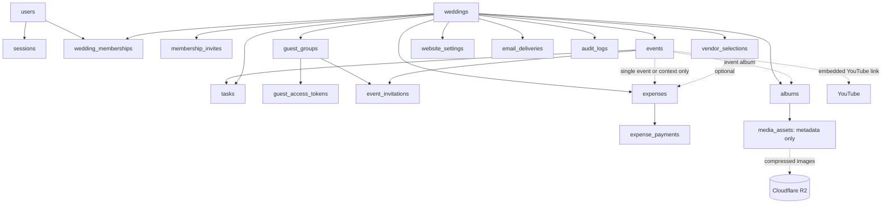

# Make My Marriage — Database Design (V1)

**Status:** Review draft · **Version:** 1.0 · **Date:** 28 September 2026  
**Database:** MongoDB Atlas · **ODM:** Mongoose · **API validation:** Zod  
**Companion documents:** Make My Marriage V1 PRD and V1 System Architecture (HLD)

> **Design contract:** One family is one guest record; one family has one active wedding invitation link; the family submits separate Yes/No RSVPs for each invited event. Expenses record actual payments without budgets or caps. Photographs and thumbnails live in Cloudflare R2, never MongoDB. Valid guest uploads are published after technical verification, **without any photo approval queue**.

## 1. Scope and modeling choices

This document defines the persistence design for the 13 V1 product modules. It uses **18 core collections** and a few embedded subdocuments. A separate `livestreams` collection is unnecessary: an event needs only an optional YouTube URL and enabled flag.

| Decision | V1 design |
|---|---|
| Tenant boundary | Every wedding-owned document has a `weddingId`; server queries must enforce it. |
| User and membership | A user can join multiple weddings; multiple members may be Wedding Admins. |
| Guest identity | A family/group is one `guest_groups` document, with no member list or headcount. |
| Guest invitation | One active token per family per wedding; separate event invitations hold RSVPs. |
| Token expiry | Wedding Admin chooses an expiry **after the wedding's final scheduled event**. Default: 30 days after that event, at the end of the local day. |
| Private gallery | `INVITED_GUESTS` means **any family invited to that wedding**, even if not invited to the album's event. |
| Media | R2 stores compressed main images and thumbnails; Atlas stores keys, dimensions, bytes and upload state. |
| Guest uploads | Technical states only: `RESERVED`, `READY`, `FAILED`, `DELETED`. **No moderation or approval status.** |
| Money | Integer paise; payment records are the source of truth for money actually paid. |
| Shared vendor cost | One wedding-wide expense, optionally linked to several events for context, never split or counted repeatedly. |
| Livestream | Embedded `livestream: { enabled, youtubeUrl }` in `events`. |
| Email | Resend delivery attempts in MongoDB; bounded batches and a daily cron; no message queue. |

### 1.1 Common conventions

- Use MongoDB `ObjectId` for internal references; examples below are TypeScript-like **document shapes**, not copy-paste-complete Mongoose schemas.
- Add Mongoose `{ timestamps: true }` to all mutable collections, except append-only audit records that require only `createdAt`.
- Store timestamps in UTC; save the wedding/event **IANA timezone** (for example, `Asia/Kolkata`) for calendar display and expiry calculations.
- Use integer **paise** for INR: ₹1,50,000 is `15000000`. No floating-point rupee fields.
- Store controlled, small objects (venue, settings, task checklist, event livestream) inside their owner document. Put independently growing data into separate collections.
- Use `deletedAt: Date | null` for selected business records; filter out deleted records by default. Preserve payment and audit history unless an explicit deletion/retention policy requires otherwise.
- Treat all client-supplied identifiers, locations, amounts, file metadata and permissions as untrusted. Validate API inputs using **Zod** and enforce document constraints with Mongoose.

## 2. Relationship overview



`weddingId` is required on every wedding-scoped record even if it also references an `eventId`, `albumId` or `expenseId`. A reference is valid only when its target belongs to the **same wedding**.

## 3. The 18 core collections

The schemas use `?` for optional fields. Fields such as IDs represent stored ObjectIds, not human-readable URLs. All string enums are additionally checked by Zod.

### 3.1 `users`

Registered Wedding Admins, Family Organizers and Platform Super Admins. Guests **do not** need user accounts.

```ts
{
  _id: ObjectId,
  displayName: string,
  email: string,                   // original display spelling
  emailNormalized: string,         // trim + lowercase
  passwordHash: string,            // bcrypt
  phone?: string,
  profileImageKey?: string,        // R2, if uploaded
  platformRole: 'USER' | 'SUPER_ADMIN',
  status: 'ACTIVE' | 'SUSPENDED',
  lastLoginAt?: Date,
  createdAt: Date, updatedAt: Date
}
```

**Indexes:** unique `{ emailNormalized: 1 }`. Email verification is **not required** at signup, login, wedding creation or membership acceptance. The platform does not assume that an unverified address proves real-world identity. Password reset still requires proof of control of the recipient mailbox.

### 3.2 `sessions`

Opaque, revocable authentication sessions; keep only token hashes in MongoDB.

```ts
{
  _id: ObjectId, userId: ObjectId,
  tokenHash: string,
  expiresAt: Date, revokedAt?: Date,
  lastSeenAt?: Date,
  createdAt: Date
}
```

**Indexes:** unique `{ tokenHash: 1 }`; `{ userId: 1 }`; TTL `{ expiresAt: 1 }` with `expireAfterSeconds: 0`. **Always check `expiresAt` and `revokedAt` in application code**: TTL deletion happens asynchronously and must not be the authorization mechanism. The browser holds the opaque token only in a secure, HTTP-only cookie.

### 3.3 `weddings`

The central tenant record. No budget, spending limit or financial allocation fields.

```ts
{
  _id: ObjectId,
  title: string,
  brideName: string, groomName: string,
  weddingDate: string,             // local YYYY-MM-DD (civil date)
  timezone: string,                // IANA zone
  slug: string,
  createdBy: ObjectId,
  status: 'ACTIVE' | 'ARCHIVED' | 'SUSPENDED',
  defaultVenue?: {
    name?: string, address?: string,
    location?: { type: 'Point', coordinates: [number, number] } // [lng, lat]
  },
  coverImageKey?: string,
  guestAccessExpiryMode: 'DEFAULT' | 'CUSTOM',
  guestAccessExpiresAt: Date,      // UTC instant; controls normal family links
  storageQuotaBytes: number,       // configurable per wedding
  storageUsedBytes: number,        // confirmed active R2 objects
  storageReservedBytes: number,    // in-progress uploads
  deletedAt?: Date,
  createdAt: Date, updatedAt: Date
}
```

**Indexes:** unique `{ slug: 1 }`; `{ createdBy: 1, createdAt: -1 }`; `{ status: 1 }`. Coordinates are kept for Google Places searches, but a MongoDB `2dsphere` index is **not needed in V1** unless we actually run MongoDB geospatial queries.

**Expiry policy:** Default `guestAccessExpiresAt` to **30 days after the final scheduled wedding event**, end-of-day in the wedding timezone; when there are no events yet, use `weddingDate`. The Wedding Admin may set a custom date, but it must be **after** the final scheduled event. If the wedding/event date changes, recompute only when `guestAccessExpiryMode === 'DEFAULT'`; otherwise prompt the admin to review the custom expiry. Backend authorization checks this date on every guest-token request. Public website pages may remain public after private guest links expire.

### 3.4 `wedding_memberships`

One document per user/wedding pair, even when an inactive member is later re-invited.

```ts
{
  _id: ObjectId, weddingId: ObjectId, userId: ObjectId,
  role: 'WEDDING_ADMIN' | 'ORGANIZER',
  permissions: {
    events: boolean, tasks: boolean, expenses: boolean,
    vendors: boolean, guests: boolean, invitations: boolean,
    gallery: boolean, website: boolean, livestream: boolean,
    members: boolean
  },
  status: 'ACTIVE' | 'REVOKED',
  joinedAt?: Date, revokedAt?: Date,
  invitedBy?: ObjectId,
  createdAt: Date, updatedAt: Date
}
```

**Indexes:** unique `{ weddingId: 1, userId: 1 }`; `{ userId: 1, status: 1 }`; `{ weddingId: 1, role: 1, status: 1 }`. Wedding Admin access is role-based and complete; organizer access is permission-based. Revoke/reactivate the existing membership instead of creating a duplicate. An authorized service operation must prevent removal of the **last active Wedding Admin**.

### 3.5 `membership_invites`

An invitation to join a wedding's management team; **different** from a guest/family invitation.

```ts
{
  _id: ObjectId, weddingId: ObjectId,
  invitedEmailNormalized: string,
  role: 'WEDDING_ADMIN' | 'ORGANIZER',
  permissions?: Record<string, boolean>,
  tokenHash: string, expiresAt: Date,
  status: 'PENDING' | 'ACCEPTED' | 'DECLINED' | 'REVOKED',
  invitedBy: ObjectId, acceptedBy?: ObjectId, acceptedAt?: Date,
  createdAt: Date, updatedAt: Date
}
```

**Indexes:** unique `{ tokenHash: 1 }`; `{ weddingId: 1, invitedEmailNormalized: 1, status: 1 }`. `expiresAt` is checked on redemption; do **not** TTL-delete this document immediately if invitation history must remain visible. Acceptance must atomically create/reactivate membership and consume the single-use token. The token is the possession proof; merely entering the invited email is **not** authorization.

### 3.6 `events`

Each wedding function has its own dates, venue and simple embedded livestream settings.

```ts
{
  _id: ObjectId, weddingId: ObjectId,
  name: string,
  type: 'HALDI' | 'MEHENDI' | 'SANGEET' | 'WEDDING' | 'RECEPTION' | 'CUSTOM',
  description?: string,
  startAt: Date, endAt?: Date, timezone: string,
  venue?: {
    name?: string, address?: string, mapUrl?: string,
    location?: { type: 'Point', coordinates: [number, number] }
  },
  coverImageKey?: string,
  status: 'DRAFT' | 'SCHEDULED' | 'COMPLETED' | 'CANCELLED',
  livestream: { enabled: boolean, youtubeUrl?: string },
  createdBy: ObjectId, deletedAt?: Date,
  createdAt: Date, updatedAt: Date
}
```

**Indexes:** `{ weddingId: 1, startAt: 1 }`; `{ weddingId: 1, status: 1 }`. Validate YouTube URLs with an allowlist, not a generic `https://` check. Creating an event should also create its default album, idempotently. Cancelling an event should preserve financial and album history.

### 3.7 `tasks`

Wedding-level (`eventId: null`) and event-specific planning tasks.

```ts
{
  _id: ObjectId, weddingId: ObjectId, eventId?: ObjectId,
  title: string, description?: string,
  status: 'TODO' | 'IN_PROGRESS' | 'COMPLETED' | 'CANCELLED',
  priority: 'LOW' | 'MEDIUM' | 'HIGH',
  dueAt?: Date, assigneeUserIds: ObjectId[],
  checklist: [{ _id: ObjectId, text: string, completed: boolean }],
  comments: [{ _id: ObjectId, authorId: ObjectId, text: string, createdAt: Date }],
  createdBy: ObjectId, completedAt?: Date, deletedAt?: Date,
  createdAt: Date, updatedAt: Date
}
```

**Indexes:** `{ weddingId: 1, status: 1, dueAt: 1 }`; `{ weddingId: 1, eventId: 1 }`; `{ weddingId: 1, assigneeUserIds: 1, status: 1 }`. Keep comments/checklists embedded only while reasonably small; enforce a V1 length/count limit.

### 3.8 `expenses`

An expense represents an agreed cost or a payable item. **No budgets or limits.** Shared vendors are one wedding-wide expense; event associations are informational only.

```ts
{
  _id: ObjectId, weddingId: ObjectId,
  scope: 'EVENT' | 'WEDDING_WIDE',
  eventId?: ObjectId,              // required for EVENT; absent for WEDDING_WIDE
  relatedEventIds: ObjectId[],     // context only; never split totals
  vendorSelectionId?: ObjectId,
  title: string, description?: string, category: string,
  agreedAmountPaise?: number,      // nonnegative integer; optional
  currency: 'INR',
  expenseDate?: Date, createdBy: ObjectId,
  deletedAt?: Date,
  createdAt: Date, updatedAt: Date
}
```

**Indexes:** `{ weddingId: 1, scope: 1, eventId: 1 }`; `{ weddingId: 1, category: 1 }`; `{ weddingId: 1, vendorSelectionId: 1 }`. Validate that `EVENT` has an `eventId` and empty `relatedEventIds`; `WEDDING_WIDE` has no `eventId` but may have multiple `relatedEventIds`. All referenced events must belong to the same wedding. For event-wise reports, include **only** `scope: 'EVENT'`; show wedding-wide spending as a separate total. Do not duplicate a shared cost across its related events.

### 3.9 `expense_payments`

The source of truth for **actual money paid**, including advances/partial payments.

```ts
{
  _id: ObjectId, weddingId: ObjectId, expenseId: ObjectId,
  amountPaise: number,             // positive safe integer
  currency: 'INR',
  paidAt: Date,
  paymentMethod: 'CASH' | 'UPI' | 'BANK_TRANSFER' | 'CARD' | 'OTHER',
  reference?: string, note?: string, receiptObjectKey?: string,
  idempotencyKey?: string,
  createdBy: ObjectId, voidedAt?: Date, voidedBy?: ObjectId,
  createdAt: Date, updatedAt: Date
}
```

**Indexes:** `{ weddingId: 1, paidAt: -1 }`; `{ expenseId: 1, paidAt: -1 }`; unique partial `{ weddingId: 1, idempotencyKey: 1 }` where a key exists. Actual spending is the sum of **non-voided** payments. `outstandingPaise = max(agreedAmountPaise - paidPaise, 0)` when an agreed amount exists. Voids require audit records; no physical payment is processed by the app. If a one-off expense is entered as already paid, create its expense and initial payment together.

### 3.10 `guest_groups`

**One family = one document**, without names or counts for individual family members.

```ts
{
  _id: ObjectId, weddingId: ObjectId,
  displayName: string,             // e.g. Sharma Family
  email?: string, emailNormalized?: string, phone?: string,
  category?: 'BRIDE_FAMILY' | 'GROOM_FAMILY' | 'FRIEND' | 'COLLEAGUE' | 'OTHER',
  notes?: string,
  createdBy: ObjectId, deletedAt?: Date,
  createdAt: Date, updatedAt: Date
}
```

**Indexes:** `{ weddingId: 1, displayName: 1 }`; `{ weddingId: 1, category: 1 }`; nonunique `{ weddingId: 1, emailNormalized: 1 }`. Do **not** add `members`, `householdSize`, `adultCount`, `plusOnes` or `attendeeCount`. Emails are optional and not necessarily unique across families. Detect probable duplicates in the UI without automatically merging them.

### 3.11 `event_invitations`

The **only source of truth** for whether a family was invited to an event and its independent RSVP.

```ts
{
  _id: ObjectId, weddingId: ObjectId,
  eventId: ObjectId, guestGroupId: ObjectId,
  rsvpStatus: 'PENDING' | 'YES' | 'NO',
  rsvpDeadline?: Date,
  responseSource?: 'GUEST_LINK' | 'ADMIN_MANUAL',
  respondedAt?: Date, updatedByUserId?: ObjectId,
  createdAt: Date, updatedAt: Date
}
```

**Indexes:** unique `{ weddingId: 1, eventId: 1, guestGroupId: 1 }`; `{ weddingId: 1, eventId: 1, rsvpStatus: 1 }`; `{ weddingId: 1, guestGroupId: 1 }`. A guest receives **one wedding invitation URL**, but that URL reads/updates only their family's `event_invitations`. Uninvited private events never appear in the RSVP response. An organizer may record phone responses. Do not derive attendee headcounts from a family RSVP.

### 3.12 `guest_access_tokens`

One **active** revocable guest link per family/wedding. Store only a SHA-256 or comparable cryptographic hash of the random token.

```ts
{
  _id: ObjectId, weddingId: ObjectId, guestGroupId: ObjectId,
  tokenHash: string,
  status: 'ACTIVE' | 'REVOKED',
  expiresAtOverride?: Date,        // optional EARLIER per-link expiry
  lastAccessedAt?: Date,
  createdBy: ObjectId, revokedAt?: Date,
  createdAt: Date, updatedAt: Date
}
```

**Indexes:** unique `{ tokenHash: 1 }`; **partial unique** `{ weddingId: 1, guestGroupId: 1 }` for `{ status: 'ACTIVE' }`. Token validity requires **all** of: active guest, active token, non-suspended wedding, `now < weddings.guestAccessExpiresAt`, and (if present) `now < expiresAtOverride`. The normal token **inherits** wedding-wide expiry; changing the wedding's configured date updates validity without rewriting every token. The per-link override may only shorten expiry. To rotate a token, revoke the old record and create the new one atomically. Do not TTL-delete tokens required for audit or revocation history.

**Gallery consequence:** after a family link expires, it can no longer view `INVITED_GUESTS` albums through that link. `PUBLIC` albums remain public if published. If a family needs post-wedding private gallery access for longer, the Wedding Admin should configure an appropriately later expiry **before** guest access ends or issue a fresh permitted link within the wedding's configured access window.

### 3.13 `vendor_selections`

A wedding-specific shortlist/booking record, **not** a copied directory of Google Places results.

```ts
{
  _id: ObjectId, weddingId: ObjectId,
  source: 'GOOGLE_PLACES' | 'MANUAL',
  googlePlaceId?: string,          // permitted identifier where applicable
  customName?: string,            // organizer-entered label
  serviceCategory: string,
  manualContact?: { phone?: string, website?: string },
  manualAddress?: string,
  status: 'SHORTLISTED' | 'CONTACTED' | 'NEGOTIATING' | 'BOOKED' | 'REJECTED',
  relatedEventIds: ObjectId[],
  quotedAmountPaise?: number, notes?: string,
  assignedOrganizerId?: ObjectId,
  addedBy: ObjectId, deletedAt?: Date,
  createdAt: Date, updatedAt: Date
}
```

**Indexes:** `{ weddingId: 1, status: 1 }`; `{ weddingId: 1, serviceCategory: 1 }`; nonunique `{ weddingId: 1, googlePlaceId: 1 }` (optionally deduplicate in the service). Retrieve live third-party display information as permitted by provider terms; store the couple's own notes, quotation, selected events and booking status. Manual vendor entry is supported when search fails or the business is unlisted.

### 3.14 `albums`

One default album per event and additional custom albums.

```ts
{
  _id: ObjectId, weddingId: ObjectId, eventId?: ObjectId,
  type: 'EVENT' | 'CUSTOM',
  title: string, description?: string,
  coverMediaAssetId?: ObjectId,
  visibility: 'PUBLIC' | 'INVITED_GUESTS' | 'ORGANIZERS_ONLY',
  guestUploadEnabled: boolean,
  sharedUploadTokenHash?: string,  // only if admin enables a QR/shared upload link
  sharedUploadExpiresAt?: Date,
  createdBy: ObjectId, deletedAt?: Date,
  createdAt: Date, updatedAt: Date
}
```

**Indexes:** `{ weddingId: 1, eventId: 1 }`; `{ weddingId: 1, visibility: 1 }`; partial unique `{ weddingId: 1, eventId: 1, type: 1 }` for active `EVENT` albums. **Visibility rule:** `INVITED_GUESTS` requires an active family invitation **for the wedding**, not for this album's particular event. Viewing permission does not imply uploading permission. If the admin enables a shared QR upload token, it acts as a revocable bearer credential; anyone holding it may upload within its restrictions. Default to family invitation-linked uploads. There are **no photo-review fields**.

### 3.15 `media_assets`

Metadata for compressed gallery photos and other wedding-owned R2 assets (covers and receipts). **Never** store image bytes or uncompressed originals here. For `purpose: 'ALBUM_PHOTO'`, `albumId` and the thumbnail are expected; for covers/receipts, `ownerId` identifies the owning wedding, event, website or expense.

```ts
{
  _id: ObjectId, weddingId: ObjectId, albumId?: ObjectId,
  purpose: 'ALBUM_PHOTO' | 'WEDDING_COVER' | 'EVENT_COVER' |
           'WEBSITE_HERO' | 'RECEIPT',
  ownerId?: ObjectId,             // owning record for non-album media
  objectKey: string, thumbnailObjectKey?: string,
  mimeType: 'image/jpeg' | 'image/webp' | 'image/png',
  width?: number, height?: number,
  reservedBytes: number, actualBytes?: number,
  uploaderType: 'REGISTERED_USER' | 'INVITED_FAMILY' | 'SHARED_UPLOAD_LINK',
  uploadedByUserId?: ObjectId, uploadedByGuestGroupId?: ObjectId,
  status: 'RESERVED' | 'READY' | 'FAILED' | 'DELETED',
  reservationExpiresAt?: Date, readyAt?: Date, deletedAt?: Date,
  createdAt: Date, updatedAt: Date
}
```

**Indexes:** unique `{ objectKey: 1 }`; `{ weddingId: 1, albumId: 1, status: 1, createdAt: -1 }`; `{ status: 1, reservationExpiresAt: 1 }`. Reserve estimated capacity **atomically** on `weddings` before issuing R2 presigned PUT URLs. Album uploads include the compressed main image and thumbnail; covers and receipts reuse the same upload/verification service and are counted in the same wedding storage quota. After verifying expected objects and actual sizes, transition to `READY`, move reserved bytes to used bytes, and immediately make the photo visible according to album privacy. `READY` is **technical completion, not approval**. Failed/abandoned reservations must release capacity and delete orphaned objects. Deleting a photo removes/blocks its R2 objects and updates accounting.

### 3.16 `website_settings`

One wedding website configuration per wedding, separate from the main wedding record.

```ts
{
  _id: ObjectId, weddingId: ObjectId,
  published: boolean,
  templateId: string,
  theme: { primaryColor?: string, secondaryColor?: string },
  heroImageKey?: string,
  welcomeMessage?: string, coupleStory?: string,
  privacy: 'PUBLIC' | 'INVITATION_ONLY',
  sections: {
    story: boolean, events: boolean, rsvp: boolean,
    gallery: boolean, livestream: boolean, venue: boolean
  },
  contactInfo?: { visible: boolean, name?: string, phone?: string, email?: string },
  createdAt: Date, updatedAt: Date
}
```

**Index:** unique `{ weddingId: 1 }`. The public website uses wedding/event data as the source of truth; do **not** copy event dates, venues or RSVP statuses into this collection. Section settings are additionally constrained by the underlying album/event invitation permissions.

### 3.17 `email_deliveries`

Simple Resend delivery attempt history; **not** a message-queue infrastructure.

```ts
{
  _id: ObjectId, weddingId?: ObjectId,
  guestGroupId?: ObjectId, membershipInviteId?: ObjectId,
  kind: 'MEMBER_INVITE' | 'GUEST_INVITE' | 'RSVP_CONFIRMATION' |
        'RSVP_REMINDER' | 'EVENT_UPDATE' | 'PASSWORD_RESET',
  recipientEmail: string,
  dedupeKey?: string,
  resendMessageId?: string,
  status: 'PENDING' | 'SENDING' | 'SENT' | 'FAILED' | 'UNKNOWN',
  attemptCount: number, lastAttemptAt?: Date, lastError?: string,
  reminderWindow?: string,          // e.g. 2026-12-01
  claimedUntil?: Date,
  createdAt: Date, updatedAt: Date
}
```

**Indexes:** partial unique `{ dedupeKey: 1 }` when present; `{ weddingId: 1, kind: 1, createdAt: -1 }`; `{ status: 1, claimedUntil: 1 }`; `{ guestGroupId: 1, kind: 1, createdAt: -1 }`. **`SENT` means accepted by Resend, not guaranteed inbox delivery**. Send in configurable batches (initially 20), respect provider limits, and persist per-recipient results. Mark ambiguous timeouts `UNKNOWN` for reconciliation rather than blindly resending. Daily cron groups pending RSVPs into **one reminder per family**, with a dedupe key per reminder window; bounded work must finish within the Vercel Function limit. No Redis, BullMQ, Kafka or dedicated worker is required for V1.

### 3.18 `audit_logs`

Append-only record of sensitive administrative and financial changes.

```ts
{
  _id: ObjectId, weddingId?: ObjectId,
  actorUserId?: ObjectId,
  actorType: 'PLATFORM_ADMIN' | 'WEDDING_ADMIN' | 'ORGANIZER' | 'SYSTEM',
  action: string,                  // e.g. MEMBER_ROLE_CHANGED
  resourceType: string, resourceId?: ObjectId,
  metadata?: Record<string, unknown>, // redacted; no raw tokens or secrets
  reason?: string,
  createdAt: Date
}
```

**Indexes:** `{ weddingId: 1, createdAt: -1 }`; `{ actorUserId: 1, createdAt: -1 }`; `{ resourceType: 1, resourceId: 1 }`. Typical events: role changes, invitation rotation, expense void, event cancellation, photo deletion, website unpublish, account/wedding suspension. Never include raw passwords, bearer tokens or unrestricted private photo URLs in audit metadata.

## 4. Critical integrity and lifecycle rules

| Operation | Database rule |
|---|---|
| Create wedding | Create `weddings`, first `WEDDING_ADMIN` membership and default `website_settings` together where transactions are supported. |
| Accept membership invite | Check token + expiry, create/reactivate membership and consume invite atomically; no email verification. |
| Remove admin | Prevent deleting/revoking the last active Wedding Admin; serialize competing removals. |
| Invite family to events | Insert/upsert one `event_invitations` per selected event; compound unique index rejects duplicates. |
| Update RSVP | Match valid wedding guest token and the exact family's event invitation; reject changes after its RSVP deadline unless an authorized organizer overrides. |
| Rotate guest link | Revoke old ACTIVE token and issue new ACTIVE token atomically; preserve RSVPs. |
| Change wedding expiry | Validate after last scheduled event; normal guest tokens inherit the new date immediately. |
| Cancel/delete event | Preserve payment history and event photos; hide cancelled events from active guest flows and reassess expiry/default albums. |
| Record vendor payment | Create one `expense_payments` record; use a request idempotency key to prevent repeated submissions. |
| Upload photo | Reserve bytes, issue signed URL, verify R2 objects, transition to `READY` and publish automatically; no human approval. |
| Remove photo | Restrict future private access, delete/tombstone R2 objects, adjust storage accounting; purge a public CDN copy where applicable. |
| Delete guest | Soft-delete family, revoke guest token and prevent future guest responses without silently destroying historical RSVP data. |

**Referential validation:** MongoDB references do not create SQL-style foreign keys. Every service that accepts an `eventId`, `albumId`, `guestGroupId`, `vendorSelectionId` or `expenseId` must verify that the referenced document belongs to the current `weddingId`.

**Transactions:** Use Atlas transactions for operations requiring atomic multi-document changes. Do not wrap ordinary single-document updates in transactions. For high-contention operations (last-admin protection, token rotation, storage reservations), use conditional updates, appropriate indexes and transaction retries. Ensure the chosen Atlas tier supports the needed deployment/transaction capabilities before relying on them.

## 5. Query and reporting patterns

### 5.1 Wedding dashboard

- Upcoming events: `events.find({ weddingId, deletedAt: null, status: 'SCHEDULED' }).sort({ startAt: 1 })`.
- Pending/overdue tasks: query by `weddingId`, assignee, status and `dueAt`.
- RSVP cards: aggregate `event_invitations` by `eventId` and `rsvpStatus`. These are **family counts**, not people counts.
- Money paid: sum `amountPaise` from **non-voided** `expense_payments` for the wedding.
- Unpaid costs: for each expense with `agreedAmountPaise`, subtract its payment sum; do not invent a budget remaining figure.
- Event-wise financial chart: group payments by expense `eventId` **only when** `scope === 'EVENT'`. Display `WEDDING_WIDE` as a separate category.

### 5.2 Example: event RSVP aggregation

```js
await EventInvitation.aggregate([
  { $match: { weddingId, eventId } },
  { $group: { _id: '$rsvpStatus', families: { $sum: 1 } } }
]);
// Example result: YES 120, NO 30, PENDING 50 (families)
```

### 5.3 Example: spending without double-counting

```js
await ExpensePayment.aggregate([
  { $match: { weddingId, voidedAt: null } },
  { $lookup: {
    from: 'expenses', localField: 'expenseId', foreignField: '_id', as: 'expense'
  } },
  { $unwind: '$expense' },
  { $match: { 'expense.deletedAt': null } },
  { $group: {
    _id: {
      scope: '$expense.scope',
      eventId: '$expense.eventId'
    },
    totalPaidPaise: { $sum: '$amountPaise' }
  } }
]);
// WEDDING_WIDE has no eventId; relatedEventIds never multiplies payment totals.
```

For audit-sensitive accounting, decide how to treat a deleted expense explicitly: normally void or archive it rather than removing already-paid historical transactions from financial reporting. The example above represents active-spending UI, not a legal ledger.

### 5.4 Pagination

Cursor-paginate large `guest_groups`, `media_assets`, `email_deliveries` and `audit_logs`. For galleries, use stable `(createdAt, _id)` ordering, plus `weddingId`, `albumId` and `status: 'READY'`. Limit results; do not return entire wedding galleries in one API response.

## 6. API validation and authorization

Zod validates route parameters, query strings and request bodies, including:

- Strict MongoDB ObjectId strings, dates, IANA timezone and enum values.
- Coordinates with `latitude ∈ [-90, 90]` and `longitude ∈ [-180, 180]`; persist GeoJSON as `[longitude, latitude]`.
- Integer paise using `z.number().int().nonnegative().safe()` for costs and positive integers for payment amounts.
- Email normalization and appropriate maximum lengths; URLs restricted by purpose (especially YouTube).
- Cross-field rules: expense scope vs event associations; upload size vs wedding quota; token expiry after the final event.

Backend authorization is **not** inferred from a valid Zod schema. Read the authenticated user or verified guest token; check `weddingId` and role/permission; then query/update the wedding-scoped record. Platform Super Admin access is separate and does not entail routine access to private wedding media or finances.

## 7. Guest access, privacy and expiry

1. The family receives **one personalized wedding URL** through email or manual sharing. Opening it never requires signup.
2. The backend hashes the supplied token to look up `guest_access_tokens` and enforces inherited wedding expiry on **every** restricted request.
3. The family sees only events represented by its `event_invitations` records; each event has its own `PENDING`, `YES` or `NO` response.
4. Any active invited family can view an album with `visibility: 'INVITED_GUESTS'`, **including an album for an event that family was not invited to**.
5. Guest viewing and upload rights are separate. Photo uploads require a valid permitted invitation token or explicitly enabled shared album-upload token.
6. Expired or revoked links cannot retrieve new signed private photo URLs. Previously downloaded photos or still-valid presigned URLs cannot be retroactively recalled; keep signed URL lifetimes short.
7. A change to album privacy from public to private requires withdrawing any public R2/CDN exposure, invalidating shared application links and purging caches as practical.

**Example expiry:** If the final wedding event is 14 December 2026 in `Asia/Kolkata`, the proposed **default** guest-link expiry is the end of 13 January 2027 local time (30 days later). A Wedding Admin can choose another date **after** the last event. The date is stored as a UTC instant after timezone conversion. If the couple wants links to end immediately after the celebration, they can select the end of the final event day instead.

## 8. R2 storage and operational consistency

```mermaid
sequenceDiagram
  participant B as Browser
  participant API as Express
  participant DB as Atlas
  participant R2 as Cloudflare R2
  B->>B: Compress photo + generate thumbnail
  B->>API: Request upload URLs (album, size, MIME)
  API->>DB: Validate access and reserve storage bytes atomically
  API->>DB: Create media_assets(status=RESERVED)
  API-->>B: Short-lived presigned PUT URLs and object keys
  B->>R2: Direct PUT compressed photo + thumbnail
  B->>API: Complete upload
  API->>R2: Verify object presence and actual sizes
  API->>DB: Set status=READY; reserved bytes -> used bytes
  API-->>B: Image visible immediately under album privacy
  Note over API,DB: No approval or pre-publication moderation
```

Use R2 presigned URLs for **direct upload** and short-lived **private read** access. Cloudflare CDN/custom-domain delivery is appropriate for *explicitly public* assets, not as a shortcut around private-bucket authorization. Presigned URLs are bearer credentials and must not be logged or exposed to unintended recipients. On V1, test JPEG/WebP quality and supported phone formats; the uncompressed original is not retained.

## 9. Resend, daily cron and failure recovery

- Create individual `email_deliveries` entries before submitting a campaign. Send **small sequential batches** (initially up to 20 messages per batch/request), preserving per-family status.
- The wedding invitation includes all of that family's invited events. An RSVP reminder should similarly group pending events into **one email per family**, not a separate email per pending event.
- The daily Vercel Cron invokes a **protected GET** endpoint; query eligible pending RSVPs, respect deadlines and configurable reminder cooldown, claim rows atomically, and send only a bounded number per invocation. Do not assume an always-running Express process.
- On transient failure, persist attempts and retry within provider limits. On an ambiguous API timeout, record `UNKNOWN` for reconciliation before resending.
- `email_deliveries` is operational send state and a delivery log, **not** a general-purpose queue. No Redis/message broker/worker is introduced in V1.

## 10. Index, retention and deployment checklist

| Concern | Implementation check |
|---|---|
| Unique guest/event RSVP | Compound unique `(weddingId, eventId, guestGroupId)` |
| Exactly one active family link | Partial unique `(weddingId, guestGroupId)` where `status='ACTIVE'` |
| Session expiry | TTL on sessions, plus synchronous expiry check |
| Wedding and album privacy | Wedding-scoped indexes and backend checks for every restricted query |
| Photo upload storage | Atomic reserve/commit/release counters; reconcile orphaned uploads |
| Provider and email security | Secrets in Vercel server environments, webhook signatures if added, redacted logs |
| Transactions | Confirm production Atlas deployment supports the selected multi-document transactional paths |
| Mongoose schema indexes | Apply through an explicit migration/index script; review before production, rather than blindly syncing indexes on every serverless invocation |
| Database recovery | Upgrade from a learning free tier to a tested backup-and-restore strategy before real weddings rely on it |
| Privacy retention | Wedding export/deletion design must address Atlas records **and** R2 objects; audit records have a defined retention policy |
| CDN | Public-only caching by default; private signed reads with short TTL; purge on privacy change |

**Reference documentation:**
- [MongoDB TTL indexes](https://www.mongodb.com/docs/manual/core/index-ttl/)
- [MongoDB unique indexes](https://www.mongodb.com/docs/manual/core/index-unique/)
- [MongoDB transactions](https://www.mongodb.com/docs/manual/core/transactions/)
- [Cloudflare R2 presigned URLs](https://developers.cloudflare.com/r2/api/s3/presigned-urls/)
- [Cloudflare R2 public buckets and custom-domain caching](https://developers.cloudflare.com/r2/buckets/public-buckets/)
- [Cloudflare R2 browser upload CORS](https://developers.cloudflare.com/r2/buckets/cors/)

## 11. Approval checklist

- [ ] Agree on the 18 collection boundaries and embedded YouTube livestream configuration.
- [ ] Confirm **wedding-wide** expense reporting for shared vendors without event allocation.
- [ ] Confirm `INVITED_GUESTS` albums are viewable by **all actively invited families of the wedding**.
- [ ] Confirm guest-link expiry: default 30 days after the final event, with an admin-selected date after the celebration.
- [ ] Confirm no guest account, individual family members, RSVP headcounts or email verification in V1.
- [ ] Confirm no photo approval state and no image bytes/original files in MongoDB.
- [ ] Confirm integer-paise payments, independent event-level RSVPs and Wedding Admin membership rules.
- [ ] Confirm V1 operational thresholds (storage quota, upload limit, cron batch size, token lifetime) during implementation testing.

**Next implementation artifact after sign-off:** concrete Mongoose model files, matching Zod schemas, migration/index definitions and API contracts.
