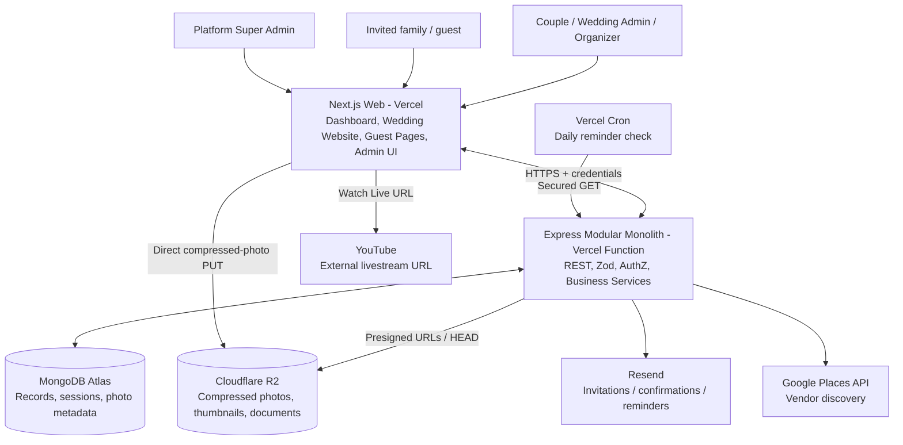
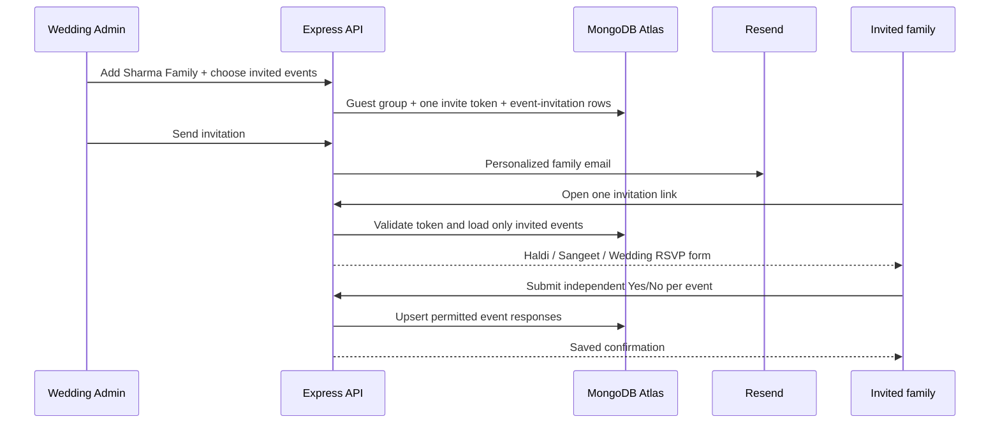

# Make My Marriage — System Architecture (HLD)

**Version:** 1.0  
**Date:** 24 September 2026  
**Status:** V1 architecture baseline; implementation parameters marked *configurable*  
**Companion document:** Make MyMarriage V1 Product Requirements Document (PRD)  
**Architecture:** Modular monolith, deployed as two Vercel applications

> **Key gallery decision:** There is **no photo approval, pending-review, or pre-publication moderation process** in V1. A person holding a valid, authorized album-upload link can upload photographs. After a successful upload and technical verification, the photos appear immediately to people who are allowed to view that album. Wedding Admins can still delete uploads afterward. An invitation link establishes permission to upload, not a guarantee of the uploader's real-world identity.

---

## 1. Goals and boundaries

### 1.1 Product goals

Make My Marriage lets a couple and authorized family members plan their wedding in a shared dashboard, while guests use an easy wedding website without creating accounts. The system supports **13 PRD modules**: authentication/wedding setup; family/organizer management; events; dashboard; tasks; expenses/payment records; vendor discovery/management; family-level guests and event-specific RSVPs; digital invitations/email; collaborative photo gallery; wedding website; YouTube livestream links; and platform administration.

### 1.2 Explicit V1 constraints

- No mandatory email verification for signup or joining a wedding via a valid invitation.
- The couple and selected family members can all be Wedding Admins. Other organizers receive explicit permissions.
- A guest record represents an entire family or invited group. **One family = one invitation link**, with separate **Yes / No / Pending** RSVP status for each invited event. No individual member directory and no headcount collection.
- Expenses track **actual money spent**, costs agreed with vendors, and outstanding payments. There are **no budgets, allocations, expense caps, or over-budget warnings**.
- Photos are compressed at high visual quality **before upload**. Store compressed originals-for-delivery and small thumbnails in **Cloudflare R2**, never photo bytes in MongoDB. Uncompressed originals are **not retained**.
- Guests with permitted album-upload access do **not** enter an approval workflow.
- Livestreaming is a **YouTube URL** attached to an event, rendered as a *Watch live* link; embedding is optional.
- Use **Resend** in small batches; one daily **Vercel Cron** for eligible RSVP reminders; **no message queue, Redis, or dedicated worker** in V1.
- Two Vercel projects (Next.js web + Express API) in one repository. Atlas, R2, Resend, and Places are managed integrations.

### 1.3 Non-goals

No microservices, self-hosted databases, native live-video delivery, streaming analytics, automated WhatsApp/SMS, paid booking/payment gateway, guest login, individual family-member profiles, original image retention, video gallery uploads, face recognition, or a photo approval queue.

---

## 2. Technology decisions

| Concern | V1 selection | Notes |
|---|---|---|
| Frontend | Next.js + React + TypeScript + Tailwind CSS | Responsive dashboard, website, guest pages, platform admin |
| Backend | Node.js + Express + TypeScript | Single modular monolith, exported as a Vercel Function |
| API | REST over HTTPS | `/api/v1`; JSON for business data |
| Validation | Zod | Boundary parsing; Mongoose also enforces storage schemas |
| Database | MongoDB Atlas + Mongoose | One logical database, wedding-scoped collections |
| Authentication | Email/password + bcrypt | No signup email verification; server-side revocable sessions |
| Session transport | Secure HTTP-only cookies | Controlled CORS/credentials and CSRF safeguards |
| Guest access | Revocable high-entropy invitation tokens | No guest login |
| Images and documents | Cloudflare R2 | Direct, short-lived presigned uploads |
| CDN | Vercel CDN + Cloudflare CDN where safe | Public assets cached; private albums not publicly cached |
| Email | Resend | Small personalized batches and delivery records |
| Venue/vendor search | Google Places API | Query using latitude/longitude; obey provider terms |
| Livestream | YouTube URL | Link only; optional embed if allowed |
| Daily reminders | Vercel Cron | Protected GET endpoint; bounded invocation |
| Hosting | 2 Vercel projects in a monorepo | Free tiers for prototype, reassess before real/commercial use |

**Rationale:** The backend is a *modular monolith*, not multiple microservices. Frontend and backend are separately deployed for clarity and scaling flexibility, while all business modules remain inside one Express codebase.

---

## 3. High-level architecture



**Trust boundaries:** Browsers never receive MongoDB credentials, R2 access keys, Resend API keys, or Google Places server credentials. Every protected Express route validates the caller's current access to the requested wedding and resource.

### 3.1 Deployment topology

- **`make-my-marriage-web`**: Next.js app on Vercel, e.g. `www.makemymarriage.com`.
- **`make-my-marriage-api`**: Express app on Vercel, e.g. `api.makemymarriage.com`.
- **Atlas**: choose a region geographically close to the API deployment and apply connection limits.
- **R2**: private bucket for gallery photos and sensitive attachments; a separate explicitly public media path/bucket for non-sensitive public website assets if required.
- **Vercel Cron**: configured on the API project for a daily `/api/v1/internal/cron/rsvp-reminders` **GET** endpoint, with `CRON_SECRET` checked server-side.

Vercel runs Express as a **Vercel Function**, not a durable always-on server. Do not depend on a local disk, in-memory session store, process-local timers, or unfinished asynchronous work surviving a response. Keep requests bounded, particularly email sending. Set Vercel function runtime/region configuration during deployment and test provider connectivity.

### 3.2 Monorepo layout

```text
make-my-marriage/
├── apps/
│   ├── web/                        # Next.js: dashboard, /w/[slug], /invite/[token], /admin
│   └── api/                        # Exported Express app for Vercel
│       └── src/
│           ├── modules/
│           │   ├── auth/
│           │   ├── weddings/
│           │   ├── memberships/
│           │   ├── events/
│           │   ├── tasks/
│           │   ├── expenses/
│           │   ├── vendors/
│           │   ├── guests/
│           │   ├── invitations/
│           │   ├── gallery/
│           │   ├── website/
│           │   ├── email/
│           │   ├── audit/
│           │   └── platform-admin/
│           ├── integrations/{resend,r2,google-places}/
│           ├── common/{errors,middleware}/
│           ├── config/
│           ├── jobs/rsvp-reminders/
│           ├── app.ts
│           └── server.ts
├── packages/
│   └── contracts/                  # Framework-independent shared DTO types and Zod contracts
├── docs/
│   ├── PRD.md
│   └── SYSTEM_Design.md
└── .github/workflows/            # Lint, test, build checks
```

Each backend module owns its routes, controllers, Zod input schemas, services, and Mongoose models. Business modules call *public service functions* of another module rather than writing directly to its collections. Shared package exports must never expose credentials or backend-only database code to the browser.

---

## 4. Application interfaces and ownership

| Module | Main responsibilities | Primary persisted records |
|---|---|---|
| Auth/users | Signup/login, bcrypt hashing, revocable sessions, password reset | `users`, `sessions` |
| Weddings | Wedding identity, couple details, configuration, coordinates | `weddings` |
| Memberships | Wedding Admins, organizers, scoped permissions, secure membership invites | `wedding_memberships`, `membership_invites` |
| Events | Functions, venues, maps, date/time, default albums | `events` |
| Dashboard (read aggregation) | Read aggregates of events, tasks, RSVP and actual payments | Read-only via public module interfaces; no owned collection |
| Tasks | Assignments, checklists, priorities, due dates, task status | `tasks` |
| Expenses | Costs, partial/full payments, receipts, outstanding balances | `expenses`, `expense_payments` |
| Vendors | Google Places discovery, own shortlist/notes, booking status | `vendor_selections` |
| Guests | One family per record | `guest_groups` |
| Invitations | One active family link, invited events, independent RSVP per event | `event_invitations`, `guest_access_tokens` |
| Email | Resend batching, RSVP reminders and delivery statuses | `email_deliveries` |
| Galleries | Albums, upload authorization, technical verification, photo metadata | `albums`, `media_assets` |
| Wedding websites | Template/theme, public vs invitation-only content, slug | `website_settings` |
| Livestream (events capability) | Simple event-specific YouTube URL | Embedded on `events`; no separate collection |
| Audit | Sensitive administrative and financial change records | `audit_logs` |
| Platform admin | Account/site operations, integration health, audits | Public module interfaces; no owned collection |

**Dashboard money fields:** total actual paid, event-wise and category-wise paid amounts, agreed-but-unpaid vendor balances, and recent payments. There is **no budget remaining** field.

---

## 5. Identity, sessions, roles, and guest access

### 5.1 Registered account flow

1. User registers with email and password; Zod validates syntax/strength, bcrypt hashes the password.
2. No verification email is required. The user may immediately log in and create a wedding.
3. Express creates an opaque random session ID; store only its digest server-side with user ID, expiry, and revocation state.
4. Return the session ID in a `Secure`, `HttpOnly` cookie. Prefer a host-only cookie for the API origin; use `SameSite=Lax` under a shared production parent domain and `fetch(..., { credentials: 'include' })`.
5. For separate origins, set an explicit allowed frontend-origin CORS policy (`Access-Control-Allow-Credentials`), never wildcard credentials. Defend state-changing routes with trusted Origin checks and/or a CSRF token.
6. At each request, validate session, membership, wedding ownership, and feature permission.
7. Password reset remains email-based. Platform Super Admin receives stronger authentication before production (MFA strongly preferred).

**No email verification caveat:** Account email ownership is unproven at signup. **Never** grant an existing wedding membership merely because a registered email matches an invitation. Require possession of the valid, single-use, expiring *membership invitation token*. This is link-based authorization; if an invite link is forwarded, the recipient may redeem it. Wedding Admins can revoke/reissue an unused invitation.

### 5.2 Roles

| Role | Access |
|---|---|
| Platform Super Admin | Platform-level user/site management; no routine access to private family photos or finances |
| Wedding Admin | Full management of **that wedding**, including inviting/promoting selected family admins |
| Family Organizer | Only explicitly granted wedding/event/module permissions |
| Guest / invited family | Token-scoped guest pages and permitted photos; **not** a registered role |

Never let admins remove the **last active Wedding Admin**. Store memberships per wedding; a user can have different roles across weddings.

### 5.3 Family invitation versus membership invitation

- **Membership invitation:** single-use secret enabling a signed-in or newly registered person to join a wedding with the invited role; no email verification required.
- **Guest/family invitation:** one revocable high-entropy secret per family for the whole wedding; token scopes guest-facing access to **only invited events** and their RSVP. No login.
- Guest links can be shared or forwarded. Treat them as bearer capabilities, not verified identities. Apply expiration/revocation, rate limits, and optional private-content restrictions.

---

## 6. MongoDB Atlas data design

**Rule:** MongoDB holds structured records and R2 object keys, **not image bytes**. Place wedding-owned data in separate collections rather than nesting all guests, events, and photos into the `Wedding` document. Add `weddingId` to all wedding-owned records and enforce it in service queries.

| Collection | Core fields | Suggested indexes |
|---|---|---|
| `users` | normalized email, passwordHash, name | unique normalized email |
| `sessions` | hashed session ID, userId, expiresAt, revokedAt | session hash unique; TTL expiry |
| `weddings` | couple names, slug, location GeoJSON, settings | unique slug; location `2dsphere` if searched |
| `wedding_memberships` | weddingId, userId, role, permissions | unique `(weddingId,userId)` |
| `membership_invites` | weddingId, invitedEmail, tokenHash, role, expiresAt, usedAt | unique token hash; expiry/index |
| `events` | weddingId, event type, start/end, venue, GeoJSON, embedded livestream {enabled, youtubeUrl?} | `(weddingId,startAt)`; location `2dsphere` when used |
| `tasks` | weddingId, eventId?, assignees, dueAt, status | `(weddingId,status,dueAt)` |
| `guest_groups` | weddingId, displayName, email?, phone?, category? | `(weddingId,displayName)`; normalized-email index when present |
| `event_invitations` | weddingId, guestGroupId, eventId, RSVP, respondedAt | **unique `(weddingId,eventId,guestGroupId)`** |
| `guest_access_tokens` | weddingId, guestGroupId, tokenHash, expiresAt?, revokedAt? | token hash unique; partial unique `(weddingId,guestGroupId)` for active tokens |
| `expenses` | weddingId, eventId?, vendorSelectionId?, category, agreedAmount | `(weddingId,eventId,category)` |
| `expense_payments` | weddingId, expenseId, amount, paidAt, receiptObjectKey? | `(expenseId,paidAt)` |
| `vendor_selections` | weddingId, placeId?, vendorName, status, notes, eventIds | `(weddingId,status)` |
| `albums` | weddingId, eventId?, visibility, uploadPolicy, title | `(weddingId,eventId)` |
| `media_assets` | weddingId, albumId, objectKey, thumbnailKey, sizes, dimensions, uploadState | `(albumId,createdAt)`; unique objectKey |
| `website_settings` | weddingId, slug, theme, publication, section visibility | unique weddingId; slug unique if not on `weddings` |
| `email_deliveries` | weddingId, guestGroupId?, kind, campaignId?, providerId?, status, attempt timestamps | `(campaignId,guestGroupId,kind)` for deduplication |
| `audit_logs` | actor, weddingId?, action, resourceId, timestamp, reason? | `(weddingId,createdAt)` |

**Financial rule:** Every payment is written once to `expense_payments`; derive paid totals from payment records and outstanding = agreed amount − summed valid payments. Each expense belongs to one event **or** is marked wedding-wide, so cross-event vendors do not cause double-counting in event charts. A vendor may be associated with several events.

**GeoJSON rule:** store a human-readable venue name/address **and** a Point with `coordinates: [longitude, latitude]` (not the reverse). Allow an event to override the wedding's default location. Location picker/geocoding should populate coordinates without users typing them.

**Transactions:** use MongoDB transactions where an operation must atomically modify multiple records (e.g. event creation + default album, membership redemption, photo quota reservation). Design for retryable writes and idempotent API calls where applicable.

---

## 7. Photo compression, upload, immediate publication, and access

### 7.1 Agreed behavior

**No approval flow.** Uploads from a valid invited guest or authorized organizer appear in the album automatically **after technical upload verification**, according to album visibility. Technical verification checks that the upload is the expected object/type/size; it is **not** a person reviewing photos. Wedding Admins may delete a photo *after* publication if it was posted accidentally or abused.

### 7.2 Storage design

- **Private R2 bucket** for compressed gallery photographs, thumbnails, and sensitive receipts/documents.
- **Optional separate public R2 bucket/path** for intentionally public cover images and other safe public media delivered through Cloudflare CDN. Publish only content the Wedding Admin marks public.
- MongoDB `media_assets` stores `objectKey`, `thumbnailKey`, metadata, and technical upload state (`RESERVED`, `READY`, `FAILED`), **not `PENDING_APPROVAL`**.
- Restrict viewing **per album**: `PUBLIC`, `INVITED_GUESTS`, or `ORGANIZERS_ONLY`; upload permission is distinct from viewing permission. `INVITED_GUESTS` includes any actively invited family of the wedding, regardless of whether that family was invited to the album's event.
- Public/CDN publication must be reversible by removing the public copy and purging caches when changing privacy. Warn that previously downloaded or externally shared public photographs cannot be recalled.

### 7.3 Compression settings: starting defaults, not guarantees

- Accept supported JPEG/PNG/WebP; handle iPhone HEIC when browser conversion is available, otherwise give a clear conversion instruction.
- Compress **in the browser** before transfer; retain only the high-quality compressed version in R2.
- Suggested maximum long edge: ~4,000 px; test JPEG/WebP quality ~0.85–0.90, preserve orientation, never upscale, generate a separate small thumbnail.
- Skip recompression if it **increases** size or visibly harms already-compressed photos. For transparent artwork, preserve transparency with an appropriate format.
- Confirm to users that **uncompressed originals will not be recoverable** from our service. Lossy compression is visually optimized, not mathematically lossless.

### 7.4 Upload sequence

```mermaid
sequenceDiagram
    participant B as Guest / Organizer browser
    participant API as Express API
    participant DB as MongoDB Atlas
    participant R2 as Private R2
    B->>B: Select images + compress locally + create thumbnails
    B->>API: POST /albums/:id/uploads/init (file metadata + guest token/session)
    API->>DB: Validate album permission and reserve quota bytes
    API-->>B: Short-lived signed PUT URLs and generated object keys
    B->>R2: PUT compressed photo and thumbnail directly
    B->>API: POST /albums/:id/uploads/complete
    API->>R2: HEAD verification for expected keys/size/type
    API->>DB: Mark media READY; commit actual usage
    API-->>B: Upload successful
    Note over API,DB: No human review or approval status
    B->>API: GET album assets using permitted access
    API-->>B: READY photos + private signed GET URLs or allowed public URLs
```

The server generates object keys (never trusts a client-supplied storage path) and signs **short-lived PUT URLs** for the exact objects and content types. Configure R2 CORS for allowed application origins and upload headers. Client-supplied file metadata must be treated as untrusted; verify stored size/content type and inspect image headers/content where feasible. Unfinished reservations expire and release quota. Enforce a configurable **bytes-per-wedding quota**, not a photo-count cap; reserve expected bytes atomically to reduce simultaneous-upload quota races.

**Guest QR codes:** An event QR may open the event's gallery. An upload action requires an invitation-linked guest token **or** an explicitly authorized, revocable *album-upload token* created by a Wedding Admin. A photographed or forwarded QR/upload link may be reused by anyone possessing it; cap uploads per token and let admins revoke shared links. This preserves no-login convenience **without** promising cryptographic identity verification.

### 7.5 Image delivery and CDN

- Next.js pages, scripts, styles, fonts: Vercel CDN.
- Intentionally public covers and public images: separate published media path through Cloudflare CDN.
- `INVITED_GUESTS` and `ORGANIZERS_ONLY` albums: Express permission check then short-lived **R2 presigned GET URLs**; **do not** expose private R2 objects through an unrestricted public CDN/custom domain.
- All endpoints generating image-access URLs must re-check wedding/album/token scope. URLs expire and should not appear in public sitemaps, analytics, or unfettered logs.

---

## 8. Guest flow and event-specific RSVP



A valid invitation token is the authorization basis for that family's RSVP. **Do not** ask for household member names or attendance totals. Responses are independently mutable until the event's configured RSVP deadline; an authorized organizer can record an offline/phone response. Rate-limit submissions and enforce the invited-event set on the server. The public wedding website can display general approved information; private event details and personalized RSVP are token-scoped.

---

## 9. Email delivery and daily reminder design (no queue)

### 9.1 Invitation sending

1. Wedding Admin selects family records and requests a preview.
2. Persist a campaign/send record and deduplicate recipients within the intended wedding/campaign.
3. The browser requests **the next small batch (default 20 personalized emails)**; Express calls Resend's batch API **within that HTTP request** and stores returned provider IDs and per-message outcomes.
4. The browser displays progress and, if needed, requests the next batch. Server enforces a per-request batch ceiling, rate limits, and available provider allowance.
5. Interrupted sending can resume using persistent delivery states. A timed-out/unknown provider result is flagged for reconciliation rather than blindly resent. Optional verified Resend delivery webhooks may update delivery statuses but are **not** a message queue.

Provider acceptance is **not** proof an email reached a recipient's inbox. Resend's limits apply to **messages**, not just the number of batch API calls. With free tiers, a large wedding may require sending over multiple days or moving to a paid plan. Keep sufficient daily capacity for password resets and critical notifications.

### 9.2 Daily RSVP reminders

- Vercel Cron invokes **HTTP GET** `/api/v1/internal/cron/rsvp-reminders` once daily; Vercel supplies the configured `CRON_SECRET` as bearer authorization.
- The endpoint selects families still `PENDING` for relevant event(s) and due for a reminder; group outstanding events into **one reminder email per family**, not one per event.
- Skip people already contacted recently, declined where no pending event remains, or within a configured opt-out/cooldown policy. A reasonable initial cooldown (configurable) is 5–7 days.
- Mark reminder attempts using an atomic claim and unique deduplication key (family + reminder window), then send **bounded** batches during the Vercel Function's lifetime.
- Store provider response and release failed claims for controlled retry. If there are more eligible recipients than can be processed safely today, store the cursor/eligibility and continue on subsequent daily runs.
- Do not use `setInterval`, a background process, BullMQ, Redis, or an in-memory queue. Daily scheduling is **not minute-precise** on free hosting.

### 9.3 Email configuration

Verify a sending **domain with Resend** (this is provider configuration, **not** account email verification). Templates: invitation, membership invite, password reset, RSVP confirmation, and pending-RSVP reminder. Secrets stay in Vercel server environments; never in Next.js public variables.

---

## 10. Vendor discovery and geo architecture

- Wedding-level and event-level venues store names, addresses, and GeoJSON coordinates. Let organizers pick a place or drop a pin rather than manually enter latitude/longitude.
- Next.js calls Express with `lat`, `lng`, category, query, and radius; **Zod** constrains all inputs.
- Express uses server-side Google Places credentials, requests appropriately scoped results, and returns a normalized API DTO for list/map presentation.
- Wedding organizers can shortlist a provider, add their own notes/quotation, tag events, and record booking/payment status. Manual entry remains a fallback.
- Persist the app's **own** shortlist/booking notes and only provider identifiers/data allowed by Google Places terms. Show required attribution, manage quota, and make API failures non-blocking for the rest of wedding planning.

---

## 11. Expense architecture: track, do not restrict

`expenses` holds an agreed cost (where known), category, one event association or wedding-wide designation, vendor reference (optional), and description. `expense_payments` holds each actual payment and optional receipt's R2 key. Compute:

```text
Total actually paid = sum(valid payment amounts)
Outstanding per expense = max(agreed cost − sum(valid payments), 0)
Event total paid = sum(payments for expenses associated with that event)
Wedding-wide total = sum(payments for all wedding expenses)
```

Display event-wise, category-wise and vendor-wise spending. Do not introduce an overall budget, event/category allocation, spending cap, "budget remaining" indicator, or over-budget warning. Changes and deletions to financial entries require authorized access and audit records; prevent double submission using idempotency keys where necessary.

---

## 12. Wedding website and YouTube live

- Wedding website route: `/w/[slug]`; support public or invitation-only website mode and per-section visibility.
- Display couple story, event schedules, venue directions, guest RSVP entry, permitted albums, and stream links according to access rules.
- Event record contains embedded `livestream: { enabled: boolean, youtubeUrl?: string }`; no separate livestream collection or service. Zod accepts only approved YouTube URL patterns and normalizes the link.
- Guest UI shows **Watch Live**, opening the configured YouTube link. Optionally embed the stream if the URL/provider settings permit; link-out remains the reliable fallback.
- No YouTube ingest, transcoding, stream scheduling orchestration, proprietary streaming service, or video storage.
- **Privacy trade-off:** An unlisted YouTube link is shareable by anyone possessing it; a private YouTube stream introduces YouTube account restrictions. Our app cannot promise truly private streaming from an ordinary shareable YouTube URL.

---

## 13. Platform administration

A protected `/admin` UI and `/api/v1/admin` API support aggregate usage, account and wedding status, integration health, email-send failures, quota settings, and critical audit trails. Admin operators must not receive unrestricted private-family photo or financial access by default. Where abuse occurs, Wedding Admins may remove uploaded photos **after publication**. Platform operators may handle reported misuse within a narrow, audited support process. **No guest-photo pre-approval, pending review, or photo moderation queue exists.**

---

## 14. API conventions and validation

**Base:** `/api/v1`, versioned REST, HTTPS only in production. Zod validates route parameters, query strings, JSON payloads, IDs, coordinates, amounts and bounded pagination. Authenticate before processing private data and authorize each wedding/resource operation; invalid input should never cause a cross-wedding lookup.

Representative endpoints (not the full OpenAPI specification):

```text
POST   /auth/signup
POST   /auth/login
POST   /auth/logout
POST   /auth/password-reset/request
POST   /auth/password-reset/complete

POST   /weddings
GET    /weddings/:weddingId
POST   /weddings/:weddingId/membership-invites
POST   /membership-invites/:token/accept
GET    /weddings/:weddingId/events
POST   /weddings/:weddingId/events
GET    /weddings/:weddingId/dashboard
GET    /weddings/:weddingId/expenses
POST   /weddings/:weddingId/expenses
POST   /expenses/:expenseId/payments
GET    /vendors/nearby?lat=...&lng=...&category=...
POST   /weddings/:weddingId/guests
POST   /weddings/:weddingId/invitations/send-batch
GET    /invite/:token
PUT    /invite/:token/rsvps
POST   /albums/:albumId/uploads/init
POST   /albums/:albumId/uploads/complete
GET    /albums/:albumId/media
DELETE /media/:mediaId
PUT    /events/:eventId/livestream
GET    /internal/cron/rsvp-reminders
```

Canonical success envelope: `{ "success": true, "data": ... }`. Failure: `{ "success": false, "error": { "code": "...", "message": "..." } }`; do not expose raw stack traces or secrets.

**Example venue contract:**

```ts
const venueSchema = z.object({
  name: z.string().min(2),
  address: z.string().min(4),
  latitude: z.number().min(-90).max(90),
  longitude: z.number().min(-180).max(180),
});
// Convert to GeoJSON Point: [longitude, latitude] at persistence boundary.
```

---

## 15. Security, privacy, reliability, and performance

### Security

- bcrypt with an appropriate cost factor; minimum password requirements and signup/login rate limits.
- Session revocation and expiry; secure cookies; CSRF/origin defense; explicit credentialed CORS policy.
- High-entropy guest/member links hashed in the database; scoped, revocable, expiring as appropriate. Avoid tokens in public analytics and third-party previews.
- Private R2 by default; short-lived presigned PUT/GET operations; image header/type/size checks; per-token and per-wedding quotas; safe object-key generation.
- Strip GPS/EXIF location metadata from public photographs where technically feasible; communicate any residual metadata risks.
- Keep environment secrets server-side. Avoid logging sensitive guest tokens, passwords or signed URLs.
- Stronger control for Platform Super Admins; MFA before onboarding real couples.

### Reliability

- Shared Mongoose connection promise/cache reused across warm Vercel invocations; conservative connection pool size; graceful DB timeout handling.
- Email status and deduplication records survive timeouts or deployment restarts. No long-running work after HTTP responses.
- Photo uploads have technical reservation/completion states. Periodically clean up orphaned/expired objects and reservations using a **bounded maintenance path** (e.g. as part of the daily scheduled maintenance); this is housekeeping, not a review queue.
- Resend, Places, R2, or YouTube outages must not prevent unrelated tasks, expense entry, or manual RSVP recording.
- Backups and restoration must be proven before storing important live wedding records; free Atlas environments should not be treated as a production backup plan.

### Observability

Track request errors, p95 API time by module, database connectivity, R2 upload failures, consumed storage bytes, Resend accepted/failed counts, cron execution counts and runtime, invitation conversions, and admin actions. Do not add invasive analytics to personalized invitation URLs.

### Baseline quality targets to test

- Mobile-first guest website and large tappable Yes/No RSVP controls; accessible labels and keyboard navigation.
- Paginated guest, task, expense and gallery APIs; handle weddings of varying sizes without fetching entire collections.
- Optimize Next.js public pages through safe cache policies; cache protected APIs conservatively (typically `no-store`).
- Validate compressed image quality, mobile upload behavior and HEIC conversion on actual test devices.

---

## 16. CI/CD and environments

- **Local:** Next.js + Express run separately; Atlas development database; nonproduction R2 bucket; Resend test configuration; mocked Places when appropriate.
- **Preview:** independent Vercel preview projects with nonproduction env vars and strict CORS allowlists; never send real bulk emails from preview.
- **Production:** `www` and `api` on a shared parent domain, production database/bucket/provider credentials, daily cron on API deployment.
- CI checks: TypeScript compile, ESLint, unit tests for service-layer rules, Zod contract tests, Mongoose index tests, and targeted integration/E2E tests (signup, membership redemption, RSVP, photo upload, payment aggregation, cron dedupe).
- Make database indexing/migration scripts explicit and reversible where feasible; record config/secret ownership.

---

## 17. End-to-end acceptance scenarios

| Test | Required outcome |
|---|---|
| Signup without email verification | User can register and create a wedding immediately |
| Membership invite | New/registered user with a valid one-time invite can join; email match alone is insufficient |
| Wedding isolation | Organizer in Wedding A cannot read/write Wedding B |
| Multiple admins | Couple and selected family members can all administer one wedding |
| Family RSVP | One link offers only invited events and supports independent Yes/No responses |
| Financial totals | Two partial payments add correctly; no budget restrictions |
| Vendor discovery | Coordinates drive nearby search; provider errors leave manual vendor entry available |
| Image compression | Only optimized images/thumbnails are stored in R2; no image bytes in MongoDB |
| **No photo approval** | A valid guest uploads, technical checks succeed, and the image becomes viewable immediately under album permissions |
| Album privacy | Guest cannot fetch an unrelated private album or another wedding's photos |
| Storage quota | Concurrent upload attempts cannot silently exceed the configured wedding quota |
| Email batch resume | An interrupted invitation campaign continues without blind duplicate sends |
| Daily reminders | Protected GET cron sends one eligible consolidated family reminder and respects cooldown |
| Livestream | Valid YouTube link opens from the event page; no native streaming server |
| Platform admin | Separate privileges and auditable sensitive actions |

---

## 18. Implementation order

1. **Foundation:** monorepo, two Vercel deployments, Atlas, Zod, auth/session, wedding setup, memberships and permissions.
2. **Core planning:** events, venue coordinates, tasks, expenses and dashboard read models.
3. **Guests and email:** family records, independent event RSVPs, invitation tokens, Resend batches, daily reminder cron.
4. **Vendor discovery:** Places, shortlist and manually tracked bookings/payments.
5. **Gallery:** browser compression, R2 presigned uploads, metadata, immediate publication, album privacy, deletion, quotas and public media CDN decisions.
6. **Guest website and YouTube:** branded website, relevant event schedule, RSVP/gallery entry, YouTube links.
7. **Platform admin and readiness:** operations, limits, logs, backup/restore, security, mobile testing, and end-to-end QA.

---

## 19. Explicit operational checkpoints (not new feature requests)

| Item | Working default / deployment action |
|---|---|
| Compression | ~4,000-pixel long edge and ~0.85–0.90 JPEG/WebP quality; verify visually |
| R2 quotas | Byte-based per wedding, configurable; include thumbnails and receipts where relevant |
| Email batches | Default 20 personalized messages/request; obey plan and runtime limits |
| Cron | Daily, bounded GET request with secret and idempotent reminder windows |
| Authentication | No email verification; robust membership token acceptance; MFA for platform operator before real use |
| Privacy | Separate public CDN assets from private signed-access album media |
| Vercel Hobby | Non-commercial prototype only; revisit paid/commercial plan and function limits before launch |
| Atlas | Select region, use connection pooling, and set up tested backups before real weddings |
| Legal/abuse | Simple terms/consent for guest uploads and an admin deletion/report mechanism; no approval queue |

---

## 20. Provider implementation references (checked 24 September 2026)

These are external **implementation references**, not hard-coded pricing or capacity commitments. Recheck them before launch.

- [Vercel: Express on Vercel](https://vercel.com/docs/frameworks/backend/express)
- [Vercel: Cron Jobs — GET requests and configuration](https://vercel.com/docs/cron-jobs)
- [Vercel: Cron Jobs — Hobby scheduling constraints](https://vercel.com/docs/cron-jobs/usage-and-pricing)
- [Vercel: Hobby plan conditions](https://vercel.com/docs/plans/hobby)
- [Cloudflare R2: Presigned URLs](https://developers.cloudflare.com/r2/api/s3/presigned-urls/)
- [Cloudflare R2: Browser CORS policy](https://developers.cloudflare.com/r2/buckets/cors/)
- [Cloudflare R2: Public buckets](https://developers.cloudflare.com/r2/buckets/public-buckets/)
- [Resend: Send batch emails](https://resend.com/docs/api-reference/emails/send-batch-emails)

---

## 21. Architecture approval summary

The V1 HLD adopts the final decisions: **two Vercel projects, modular Express monolith, Next.js frontend, Zod, bcrypt, MongoDB Atlas/Mongoose, Resend, Cloudflare R2, browser-compressed high-quality photos only, approved-access-based immediate gallery publication with NO photo approval stage, Cloudflare/Vercel CDN where safe, geo-coordinates for vendors, simple YouTube URLs, and a daily cron without message queues**.

This document is the implementation baseline alongside the finalized PRD. Any subsequent architectural change should be recorded as a small architecture decision record (ADR) rather than silently altering these core decisions.
